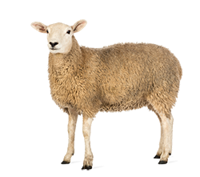
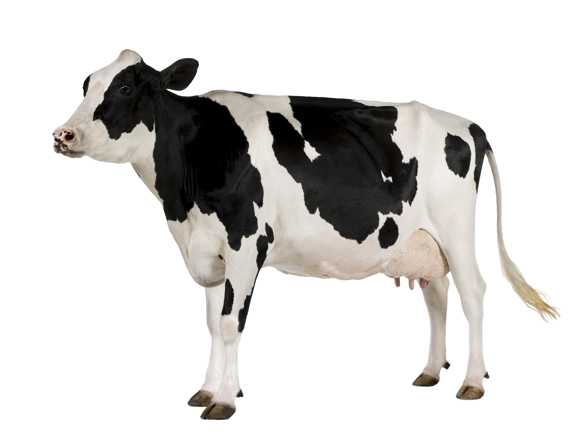

```{r setup, echo=FALSE, warning=FALSE, message=FALSE}
library(tidyverse)
library(lubridate)
library(meshblocknz)
library(knitr)
library(mgcv)
library(sf)
library(shiny)
library(gtools)
library(gganimate)
library(transformr)
theme_set(theme_bw(base_size=15) + theme(plot.background = element_rect(fill = "transparent", color = NA)))
#theme_update(theme(plot.background = element_rect(fill = "transparent", color = NA)))
opts_chunk$set(echo=FALSE, message=FALSE, warning=FALSE, fig.height = 5, fig.align='center', bg='transparent', dev.args=list(bg='transparent'))
attr_data <- read.csv("data/attribution_data.csv") %>%
  filter(Source != "Human" | Year >= 2008)
sts = attr_data %>%
  group_by(ST) %>% count(Source) %>% spread(Source, n, fill=0) %>%
  ungroup()
sts_ur = attr_data %>% filter(Source == "Human") %>%
  group_by(ST) %>% count(UR2006) %>% ungroup()
nz = read_csv("data/dhb_cases.csv") %>%
  mutate(Date = dmy(paste(1, Month, Year))) %>%
  filter(Year >= 2006) %>% group_by(Date) %>%
  summarise(Count = sum(Count, na.rm=TRUE), Population = sum(PopulationInterpolated, na.rm=TRUE)) %>%
  mutate(Rate = Count/Population*100000*12)

attribution = read.csv("data/attribution.csv")
alpha = function(col, alpha) { rgb(t(col2rgb(col)/255), alpha=alpha) }
par(mar=c(3,3,2,1), mgp=c(2,.7,0), tck=-.03)
ax_col = "grey20"
fig_width = 10

source_cols <- c(Poultry="brown", Ruminants="steelblue2", Other="plum4", Water="green4")
```

## New Zealand campylobacteriosis cases

```{r, nz cases, fig.width=fig_width}
ggplot(nz, aes(x=Date, y=Rate)) + geom_line(col='grey50') +
  geom_smooth(span=0.5, col="steelblue", fill="steelblue", alpha=0.3) +
  scale_y_continuous("Cases per 100,000 people per year", expand = c(0,0), lim=c(0,600)) +
  scale_x_date(expand = c(0,0)) +
  theme(axis.title.x = element_blank())
```

## Manawatu sentinel surveillance site

```{r, manawatu map, fig.width=8.5, fig.height=6}
manawatu = read_sf("maps/midcentral.shp")

nzmg.proj = '+proj=nzmg +lat_0=-41.0 +lon_0=173.0 +x_0=2510000.0 +y_0=6023150.0 +ellps=intl +units=m +towgs84=59.47,-5.04,187.44,0.47,-0.1,1.024,-4.5993 '

nz.map = read_sf("maps/NZ_region-NZTM2000.shp", layer="NZ_region-NZTM2000") #, verbose=FALSE)
#nz2.map = nz.map %>% st_transform(nzmg.proj)
manawatu <- manawatu %>% st_set_crs(nzmg.proj)

st_crs(manawatu) <- nzmg.proj
ggplot() + geom_sf(data = nz.map, fill = "grey80", col=NA, stroke=0) +
  geom_sf(data = manawatu, fill="steelblue", col = NA, stroke = 0) +
  theme_void()
```

## Where are people getting it from?

<div align="center">
<span class='inline'>
  
  
  
</span>
</div>

## MLST distribution of human cases

```{r, mlst dist human, fig.width=10}
# top 20 or so isolates
top20 <- sts %>% mutate(ST = fct_lump(factor(ST), n=20, w=Human)) %>% gather(Source, Count, -ST) %>%
  group_by(ST, Source) %>% summarise(Count = sum(Count)) %>% group_by(Source) %>% mutate(Count = Count/sum(Count)) %>% ungroup() %>%
  spread(Source, Count) %>% mutate(ST = fct_reorder(ST, Human, .fun = identity, .desc=TRUE),
                                   ST = fct_relevel(ST, "Other", after = 23)) %>%
  gather(Source, Count, -ST, -Human) %>%
  mutate(Source = fct_relevel(Source, "Other", after=2)) %>%
  mutate(Colour = ST == "Other")

top_humans <- top20 %>% select(Human, ST, Colour) %>% unique()
ggplot(top_humans, aes(x=ST, y=Human, fill=Colour)) + 
  geom_col() +
  scale_fill_manual(values=c("steelblue", "grey60")) +
  scale_y_continuous("Percent human cases", labels = scales::percent, expand=c(0,0)) + 
  coord_cartesian(ylim = c(0,0.25)) +
  guides(fill='none') +
  theme(axis.title.x = element_blank(),
        axis.text.x = element_text(angle = 90, vjust=0.5))
```

## MLSTs are source specific

```{r, source specific mlst, fig.width=10}
ggplot(top20, aes(x=ST, y=Count, fill=Colour)) + geom_col(data=top_humans, aes(y=Human), alpha=0.3) + geom_col(aes(y=Count)) +
  scale_fill_manual(values=c("steelblue", "grey60")) +
  scale_y_continuous("Percent isolates", labels = scales::percent, expand=c(0,0)) +
  coord_cartesian(ylim = c(0,0.25)) +
  facet_wrap(~Source) +
  guides(fill='none') +
  theme(axis.title.x = element_blank(),
        axis.text.x = element_text(angle = 90, vjust=0.5))
```

## Assume human types are a mix of source types {#slideID} 

<iframe src="http://shiny.massey.ac.nz/jcmarsha/OHA2019/" style="border: none"></iframe>

## Adding statistics {.bigequation .flexbox .vcenter}

$$
P(\mathsf{Human~cases}) = \prod_h P(\mathsf{st}_h)
$$

## Adding statistics {.bigequation .flexbox .vcenter}

$$
P(\mathsf{st}_h) = \sum_j P(\mathsf{st}_h~\mathsf{from~source}_j) P(\mathsf{source}_j)
$$

## Adding statistics {.bigequation .flexbox .vcenter}

$$
P(\mathsf{st}_h) = \sum_j \underbrace{P(\mathsf{st}_h~\mathsf{from~source}_j)}_\text{genomic model} P(\mathsf{source}_j)
$$

## Adding statistics {.bigequation .flexbox .vcenter}

$$
P(\mathsf{st}) = \sum_j \underbrace{P(\mathsf{st}_h~\mathsf{from~source}_j)}_\text{genomic model} \underbrace{P(\mathsf{source}_j)}_\text{attribution to source}
$$

# Genomic models

## Asymmetric Island model | D. Wilson (2009)

Assume that genotypes arise from two or more homogeneous mixing populations
where we have

- **Mutation**, where novel alleles are produced.

- **Recombination**, where the allele at a given locus has been observed before, but
not in this allelic profile (i.e. the alleles come from at least two different genotypes).

- **Migration** between sources of genotypes and alleles.

## Asymmetric Island model{.smaller}

We model $P(\mathsf{st}_h~\mathsf{from~source}_j)$ via:

$$
P(\mathsf{st}_h \mid j,X) = \sum_{c\in X} \frac{M_{S_cj}}{N_{S_c}} \prod_{l=1}^7 \left\{\begin{array}{ll}
\mu_j & \text{if $\mathsf{st}_h^{l}$ is novel,}\\
(1-\mu_j)R_j\sum_{k=1}^J M_{kj}f^l_{\mathsf{st}_h^lk} & \text{if $\mathsf{st}_h^{l}\neq c^l$}\\
(1-\mu_j)\left[1 - R_j(1 - \sum_{k=1}^J M_{kj}f^l_{\mathsf{st}_h^lk})\right] & \text{if $\mathsf{st}_h^{l}=c^l$}
\end{array} \right.
$$

- $c \in X$ are candidate sequences from which $\mathsf{st}_h$ evolved (all sequences other than $\mathsf{st}_h$).
- $S_c$ is the source where candidate sequence $c$ was observed.
- $N_{S_c}$ is the number of types observed on source $S_c$.
- $\mu_j$ be the probability of a novel mutant allele from source $j$.
- $R_j$ be the probability that a type has undergone recombination in source $j$.
- $M_{kj}$ be the probability of an allele migrating from source $k$ to $j$.
- $f^l_{ak}$ be the frequency with which allele $a$ has been observed at locus $l$ in those genotypes sampled from source $k$.

## Asymmetric Island model

Use the source isolates to estimate the unknown parameters:

- The mutation probabilities $\mu_j$
- Recombination probabilities $R_j$
- Migration probabilities $M_{jk}$.

using a leave one out pseudo-likelihood MCMC algorithm.

Once we have these estimated, we can use all source sequences as candidates and estimate $P(\mathsf{st}_h~\mathsf{from~source}_j)$ for the observed human sequences (even those unobserved on the sources).

## Dirichlet model

Before we collect data, assume each type is equally likely for each source.

```{r, fig.width=10, fig.height=3.5}
set.seed(5)
top50 <- sts %>% mutate(ST = fct_lump(factor(ST), n=49, w=Human)) %>%
  gather(Source, Count, -ST) %>% 
  group_by(ST, Source) %>% summarise(Count = sum(Count)) %>%
  ungroup() %>% spread(Source, Count) %>%
  mutate(ST = fct_reorder(ST, Human, .fun = identity, .desc=TRUE),
                          ST = fct_relevel(ST, "Other", after = 50)) %>%
  select(ST, Poultry) %>% uncount(Poultry) %>%
  sample_n(100) %>% count(ST, name = "Poultry", .drop=FALSE) %>%
  mutate(Prior = 1) %>%
  gather(Source, Count, -ST) %>% mutate(Proportion = Count/sum(Count))
scale_fact <- 1/sum(top50$Count)

ggplot(top50 %>% filter(Source == "Prior"), aes(x=ST, y=Count)) + geom_col(fill="grey50") +
  scale_y_continuous("Count", expand=c(0,0)) +
  coord_cartesian(ylim = c(0,25)) +
  theme(axis.title.x = element_blank(),
        axis.text.x = element_text(angle = 90, vjust=0.5))
```

## Dirichlet model

Then add the observed counts.

```{r, fig.width=10, fig.height=3.5}  
ggplot(top50, aes(x=ST, y=Count, fill=Source)) + geom_col() +
  scale_y_continuous("Count", expand=c(0,0)) +
  scale_fill_manual(values=c(Poultry = "steelblue", Prior = "grey40")) +
  guides(fill='none') +
  coord_cartesian(ylim = c(0,25)) +
  theme(axis.title.x = element_blank(),
        axis.text.x = element_text(angle = 90, vjust=0.5))
```

## Dirichlet model

And convert to proportions.

```{r, fig.width=10, fig.height=3.5}  
ggplot(top50, aes(x=ST, y=Proportion, fill=Source)) + geom_col() +
  scale_y_continuous("Percent", labels = scales::percent_format(accuracy=1, suffix=""), expand=c(0,0)) +
  scale_fill_manual(values=c(Poultry = "steelblue", Prior = "grey50")) +
  guides(fill='none') +
  coord_cartesian(ylim = c(0,25*scale_fact)) +
  theme(axis.title.x = element_blank(),
        axis.text.x = element_text(angle = 90, vjust=0.5))
```

## Dirichlet model

Get uncertainty directly.

```{r, gganimate = list(nframes = 220, fps = 20), fig.width=10, fig.height=3.5, fig.retina=1, dpi=96}
alpha <- top50$Count
random <- as.data.frame(t(rdirichlet(20, alpha)))
#random <- bind_cols(random, V21=random[,1])

uncertainty <- bind_cols(top50, random) %>%
  select(-Count, -Proportion) %>% gather(Iteration, Proportion, V1:V20) %>%
  extract(Iteration, into="Iteration", regex="([0-9]+)", convert=TRUE)

# plot
anim <- ggplot(uncertainty, aes(x=ST, y=Proportion, fill=Source)) + geom_col() +
  scale_y_continuous("Percent", labels = scales::percent_format(accuracy=1, suffix=""), expand=c(0,0)) +
  scale_fill_manual(values=c(Poultry = "steelblue", Prior = "grey50")) +
  guides(fill='none') +
  coord_cartesian(ylim = c(0,25*scale_fact)) +
  theme(plot.background = element_rect(fill = "white", color = NA),
        axis.title.x = element_blank(),
        axis.text.x = element_text(angle = 90, vjust=0.5)) +
  transition_states(Iteration, transition_length = 1, state_length = 0.1) +
  ease_aes('cubic-in-out')

anim
```

## Dirichlet model | S.J. Liao 2019

The prior and data model are:

$$
\begin{aligned}
\mathbf{\pi}_j &\sim \mathsf{Dirichlet}(\mathbf{\alpha}_j)\\
\mathbf{X}_{j} &\sim \mathsf{Multinomial}(n_j, \mathbf{\pi}_j)
\end{aligned}
$$

so that the posterior is
$$
\mathbf{\pi}_{j} \sim \mathsf{Dirichlet}(\mathbf{X}_j + \mathbf{\alpha}_j)
$$

where $\pi_j$ is the genotype distribution, $\mathbf{X}_j$ are the counts, and $\mathbf{\alpha}_j$ is the prior for source $j$.

## Genotype distributions

```{r, fig.width=10}
genotype_fit <- read_csv("data/genotypes.csv") %>%
  mutate(Source = factor(Source, levels = c("Poultry", "Ruminants", "Other", "Water")))

common_sts <- c(474, 45, 50, 53, 48, 61, 190, 42) #, 354, 520)
plot_common <- genotype_fit %>% filter(ST %in% common_sts) %>%
  mutate(ST = factor(ST, levels=common_sts, labels = paste0("ST-", common_sts)),
         Source = fct_recode(Source, Rum = "Ruminants"))

ggplot(plot_common) + geom_linerange(aes(x=Source, ymin = lci, ymax=uci, group=Model), position=position_dodge(0.5)) + 
  geom_linerange(aes(x=Source, ymin = lcl, ymax = ucl, col=Model), size=2, position=position_dodge(0.5)) +
  geom_point(aes(x=Source, y=m, fill=Model), position=position_dodge(0.5), shape=21, size=2) +
  facet_wrap(~ST, nrow=2) +
  xlab("") +
  scale_y_continuous(name = "P(Source | ST)", limits=c(0,1), expand = c(0,0)) +
  scale_fill_manual(values = c("steelblue2", "brown")) +
  scale_colour_manual(values = c("steelblue2", "brown")) +
  theme(legend.position = c(0.93,0.89),
        legend.title = element_blank())
```

## Genotype distributions

```{r, fig.width=7}
sts <- c(403, 2343, 2026, 474)
plot_weird <- genotype_fit %>% filter(ST %in% sts) %>%
  mutate(ST = factor(ST, levels=sts, labels = paste0("ST-", sts)))

ggplot(plot_weird) + geom_linerange(aes(x=Source, ymin = lci, ymax=uci, group=Model), position=position_dodge(0.5)) + 
  geom_linerange(aes(x=Source, ymin = lcl, ymax = ucl, col=Model), size=2, position=position_dodge(0.5)) +
  geom_point(aes(x=Source, y=m, fill=Model), position=position_dodge(0.5), shape=21, size=2) +
  facet_wrap(~ST, nrow=2) +
  xlab("") +
  scale_y_continuous(name = "P(Source | ST)", limits=c(0,1), expand = c(0,0)) +
  scale_fill_manual(values = c("steelblue2", "brown")) +
  scale_colour_manual(values = c("steelblue2", "brown")) +
  theme(legend.position = c(0.90,0.89),
        legend.title = element_blank())
```

## Attribution results

```{r, fig.width = 7}
overall <- read_csv("data/overall_attribution.csv") %>%
  mutate(Source = fct_relevel(Source, "Other", after=2))

ggplot(overall) + 
  geom_boxplot(aes(x=Source, lower = lcl, upper=ucl, ymin=lci, ymax=uci, middle=m, fill=Source), stat="identity", alpha=0.7, width=0.6) +
  scale_y_continuous(name="Attributed cases", labels=scales::percent_format(), limits=c(0,1), expand=c(0,0)) +
  scale_fill_manual(values = source_cols) +
  facet_wrap(~Model) +
  guides(fill='none', col='none') +
  theme(axis.title.x = element_blank(),
        legend.position = c(0.90,0.89),
        legend.title = element_blank())
```

# Adding covariates

## MLSTs differ by rurality

```{r, mlst dist rurality, fig.width=10}
top20_ur <- sts_ur %>% group_by(ST) %>% mutate(Total = sum(n)) %>% ungroup() %>%
  mutate(ST = fct_lump(factor(ST), n=20, w=Total)) %>%
  group_by(ST, UR2006) %>% summarise(n = sum(n)) %>% mutate(total = sum(n)) %>% group_by(UR2006) %>%   mutate(n = n/sum(n)) %>% ungroup() %>%
  spread(UR2006, n) %>% mutate(ST = fct_reorder(ST, total, .fun = identity, .desc=TRUE),
                                    ST = fct_relevel(ST, "Other", after = 23)) %>%
  gather(UR2006, Count, -ST, -total)

highlight <- top20_ur %>% group_by(ST) %>% summarise(d = diff(Count), m = mean(Count)) %>% filter(abs(d/m) > 0.3, m > 0.016)

plot20_ur <- top20_ur %>% left_join(highlight) %>% mutate(Colour = case_when(ST == "Other" ~ "Other",
                                                                !is.na(d) ~ "Highlight",
                                                                TRUE ~ "Normal"))

ggplot(plot20_ur, aes(x=ST, y=Count, fill=Colour)) + geom_col() +
  scale_fill_manual(values=c(Normal = alpha("steelblue", 0.5), Other = "grey60", Highlight="steelblue")) +
  scale_y_continuous("Percent human cases", labels = scales::percent, expand=c(0,0)) +
  coord_cartesian(ylim = c(0,0.25)) +
  facet_wrap(~UR2006, nrow=2) +
  guides(fill='none') +
  theme(axis.title.x = element_blank(),
        axis.text.x = element_text(angle = 90, vjust=0.5))
```

## Attribution with covariates{.largeequation .flexbox .vcenter}

$$
P(\mathsf{st}_h \mid \underbrace{\mathbf{x}_h}_\text{covariates}) =
 \sum_j \underbrace{P(\mathsf{st}_h~\mathsf{from~source}_j)}_\text{genomic model} \underbrace{P(\mathsf{source}_j \mid \mathbf{x}_h)}_\text{attribution with covariates}
$$

## Attribution with covariates

Within each source $j$ we have a linear model on the logit scale for attribution:
$$
\begin{aligned}
\eta_{hj} &= \alpha_j + \beta_{j1} x_{1h} + \cdots + \beta_{jp} x_{ph}\\
P(\mathsf{source}_j \mid \mathbf{x}_h) &= \frac{\exp(\eta_{hj})}{\sum_j \exp(\eta_{hj})}
\end{aligned}
$$

The covariates can then be anything we like for each human case, and there's a separate attribution probability for each unique covariate pattern in the data.

## Covariates: Rurality, Age, Season

We'll present four different covariate models:

- Seasons by urban/rural split.
- Rurality as 7 separate categories.
- Rurality as a linear trend (on logit scale).
- Separate linear trends for under 5 versus older than 5 years old (2008 onwards).

# Results

## Seasonality

```{r, fig.width = 10}
plot_df <- read_csv("data/season_attribution.csv") %>%
  mutate(Source = factor(Source, levels=rev(c("Other", "Water", "Ruminants", "Poultry")),
                         labels=rev(c("Other", "Water", "Rum", "Poultry"))),
         Season = factor(Season, levels=c("Autumn", "Winter", "Spring", "Summer"))) %>%
  mutate(x = as.numeric(interaction(Model, Source)))

ggplot(plot_df) + geom_boxplot(aes(x=x, lower = lcl, upper=ucl, ymin=lci, ymax=uci, middle=m, fill=factor(x), group=x), stat="identity", alpha=rep(c(1, 0.4),32), width=0.6) +
  facet_grid(UR2006~Season) +
  scale_fill_manual(values = rep(source_cols, each=2) %>% unname()) +
  scale_x_continuous(breaks=0.5+c(1,3,5,7), labels = levels(plot_df$Source)) +
  scale_y_continuous(name="Percentage of cases", labels=scales::percent_format(), limits=c(0,1), expand=c(0,0)) +
  guides(fill = 'none') +
  theme(axis.title.x = element_blank())
```

## Urban/Rural scales

```{r, fig.width = 10}
plot_df <- read_csv("data/cat_lin_compare.csv") %>%
  mutate(Source = factor(Source, levels=rev(c("Other", "Water", "Ruminants", "Poultry"))))
ggplot(plot_df) +
  geom_ribbon(aes(x=UR2006_num, ymin=lcl, ymax=ucl, fill=Source), alpha=0.3) +
  geom_ribbon(aes(x=UR2006_num, ymin=lci, ymax=uci, fill=Source), alpha=0.3) +
  geom_line(aes(x=UR2006_num, y=m, col=Source), lwd=1) +
  facet_grid(GenotypeModel~AttributionModel) +
  scale_x_continuous(name=NULL, breaks=c(-3,3), labels=c("Rural", "Urban"), expand=c(0,0)) +
  scale_y_continuous(name="Percentage of cases", labels=scales::percent_format(), limits=c(0,1), expand=c(0,0)) +
  scale_color_manual(name=NULL, values = source_cols) +
  scale_fill_manual(name=NULL, values = source_cols) +
  theme(axis.text.x = element_text(hjust=c(-0.1,1.1)),
        axis.text.y = element_text(vjust=c(-0.1,rep(0.5, 3), 1.1)))
```

## Young kids

```{r, fig.width = 10}
plot_df <- read_csv("data/age.csv") %>%
  mutate(Source = factor(Source, levels=rev(c("Other", "Water", "Ruminants", "Poultry"))))

# plot
ggplot(plot_df) +
  geom_ribbon(aes(x=UR2006_num, ymin=lc, ymax=uc, fill=Source), alpha=0.3) +
  geom_ribbon(aes(x=UR2006_num, ymin=li, ymax=ui, fill=Source), alpha=0.3) +
  geom_line(aes(x=UR2006_num, y=m, col=Source), lwd=1) +
  facet_grid(GenotypeModel~Age) +
  scale_x_continuous(name=NULL, breaks=c(-3,3), labels=c("Rural", "Urban"), expand=c(0,0)) +
  scale_y_continuous(name="Percentage of cases", labels=scales::percent_format(), limits=c(0,1), expand=c(0,0)) +
  scale_color_manual(name=NULL, values = source_cols) +
  scale_fill_manual(name=NULL, values = source_cols) +
  theme(axis.text.x = element_text(hjust=c(-0.1,1.1)),
        axis.text.y = element_text(vjust=c(-0.1,rep(0.5, 3), 1.1)))
```

## Summary

- The Island model assigns genotypes not observed on sources where the Dirichlet model has no information. **But few cases are of this type**.

- The simple Dirichlet model seems to do just as well as the Island model.

- Urban cases tend to be more associated with poultry, and rural cases with ruminants, with a linear relationship between attribution and rurality being adequate.

- Kids under 5 in rural areas are more likely to have ruminant associated campylobacteriosis compared to over 5's.

- Strong evidence for seasonality of attribution, with a higher proportion of poultry related cases in summer and strong ruminant association in rural areas in winter and spring.

# What if we have more genes?

## What if we have more genes?

- With higher genomic precision, the counts used for the Dirichlet model will eventually drop to 1 of each as each isolate is likely unique.

- Worse than that, the human isolates will differ from all source isolates, so the source counts for them will be 0, so we lose all ability to discriminate.

- In theory the Island model should still work.

- But it... **doesn't :(**

## Island model attribution with more genes

```{r}
many_genes <- read_csv("data/many_genes.csv")
ggplot(many_genes %>% filter(Model == "PerSource"), aes(x=Genes, y=fits, fill=Source, col=Source)) +
  geom_ribbon(aes(ymin=fits-0.03, ymax = fits+0.03), alpha=0.4, col='transparent') +
  geom_line(lwd=1) +
  scale_y_continuous("Attribution of human cases", labels = scales::percent, expand=c(0,0), limits = c(-1,1)) +
  coord_cartesian(ylim = c(0,1)) +
  scale_x_continuous(limits = c(5,100), expand=c(0,0)) +
  guides(col = 'none', fill='none')
```

## Why does this happen?

The island likelihood for each type is complicated, but if we have $g$ genes is approximately
$$
p(\mathsf{st} \mid m) \approx m^d (1-m)^{g-d}
$$
where $m$ is a combination of mutation and recombination probabilities, and $d$ is the average number of loci that differ between isolate pairs.

This is maximised when $m = d/g$ so that
$$
p(\mathsf{st} \mid m) \approx  f(m)^g
$$
where
$$
f(m) = m^m (1-m)^{1-m}
$$

## Why does this happen?

Suppose we have two sources with $m_1=0.02$ and $m_2=0.03$.

```{r}
f <- function(m) { m^m *(1-m)^(1-m) }
fm <- expand.grid(m = c(0.02, 0.03), g = 1:100) %>% mutate(f = f(m)^g)
df <- fm %>% group_by(g) %>% summarise(df=exp(-diff(log(f))))
expr <- expression(paste("p( st |" ~ m[1] ~ ") / (p( st |"~m[2]~")"))
ggplot(df, aes(x=g, y=df)) + geom_line(lwd=2) +
  scale_y_continuous(expr, expand=c(0,0), lim=c(0,40)) + scale_x_continuous("Number of genes", expand=c(0,0))
```

The island model just ends up assigning everything to the lower diversity source.

## Can we avoid it?

- Instead of per-source estimates of recombination and mutation probabilities, make them common across all sources.

- This then stabilises the genotype probability distributions to be the same order of magnitude across all sources.

- We thus get sensible attribution with increasing gene counts

## Stable attribution as gene count increases

```{r}
ggplot(many_genes %>% filter(Model == "Common"), aes(x=Genes, y=fits, fill=Source, col=Source)) +
  geom_ribbon(aes(ymin=fits-0.03, ymax = fits+0.03), alpha=0.4, col='transparent') +
  geom_line(lwd=1) +
  scale_y_continuous("Attribution of human cases", labels = scales::percent, expand=c(0,0), limits = c(-1,1)) +
  coord_cartesian(ylim = c(0,1)) +
  scale_x_continuous(limits = c(5,100), expand=c(0,0)) +
  guides(col = 'none', fill='none')
```

## Summary

- As we increase the number of genes, the Dirichlet model loses all ability to differentiate between sources.

- The Island model still works as it should, but we need to estimate shared mutation and recombination probabilities.

- We get a stable attribution as the number of genes increases.

- **But how should we choose genes?**

## Acknowledgements {.banner}

- Sih-Jing Liao, Nigel French, Martin Hazelton
- **MidCentral Public Health Services**
- **Medlab Central**
- **ESR**: Phil Carter
- **mEpiLab**: Rukhshana Akhter, Julie Collins-Emerson,<br>
Ahmed Fayaz, Anne Midwinter, Sarah Moore, Antoine Nohra,<br>
Angie Reynolds, Lynn Rogers, David Wilkinson
- **Ministry for Primary Industries**


## {.banner}

Twitter: [&#64;jmarshallnz](https://twitter.com/jmarshallnz)

Github:  [jmarshallnz](https://github.com/jmarshallnz)

<div class="hugetext">**Thanks for listening!**</div>


## Aymmetric Island model | D. Wilson (2009)

Assume that genotypes arise from two or more homogeneous mixing populations
where we have

- **Mutation**, where novel alleles are produced.

- **Recombination**, where the allele at a given locus has been observed before, but
not in this allelic profile (i.e. the alleles come from at least two different genotypes).

- **Migration** between sources of genotypes and alleles.

## Mutation

 ST   aspA  glnA  gltA  glyA  pgm  txt  uncA
---  ----- ----- ----- ----- ---- ---- -----
474     2     4     1     2     2    1    5
?       2     4     1     2    29    1    5

<br />

- We have a novel allele at the pgm locus.

- We assume this genotype has arisen through **mutation**.

## Recombination

 ST   aspA  glnA  gltA  glyA  pgm  txt  uncA
---  ----- ----- ----- ----- ---- ---- -----
474     2     4     1     2     2    1    5
?       2     4     1     2     1    1    5
45      4     7    10     4     1    7    1
3718    2     4     1     4     1    1    5

<br />

- We have seen this pgm allele before, but haven't seen this genotype.

- We assume it arose through **recombination**, either from 45 or 3718.

## Migration

 ST   aspA  glnA  gltA  glyA  pgm  txt  uncA
---  ----- ----- ----- ----- ---- ---- -----
474     2     4     1     2     2    1    5
?       2     4     1     2     2    1    5

<br />

- This is just 474. We've seen it before, but possibly not on this source.

- We assume it arose through **migration**.
