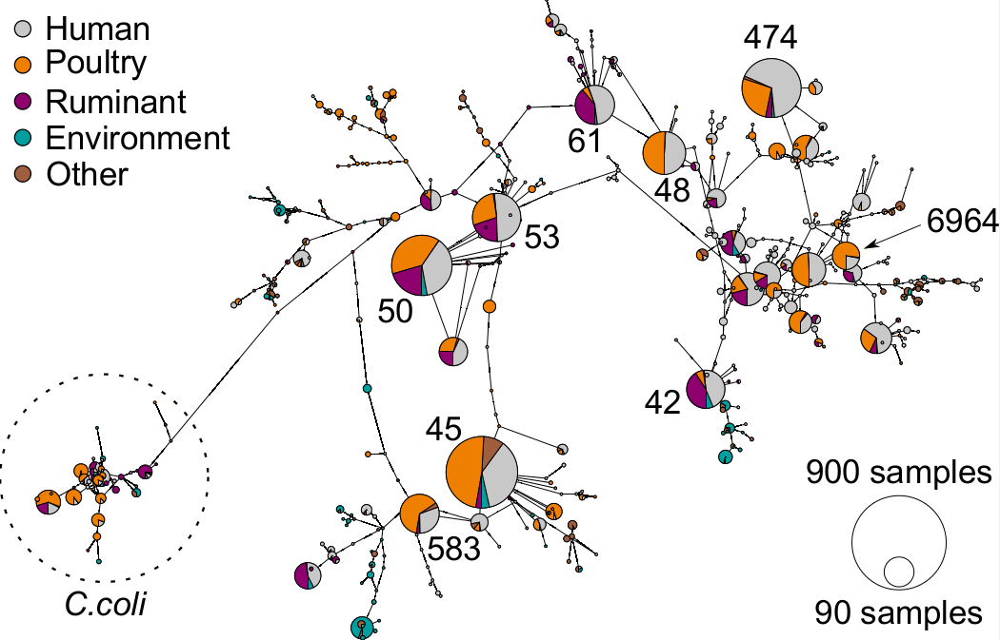
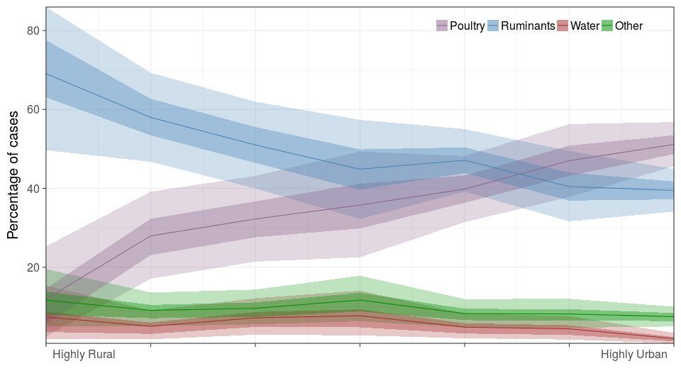
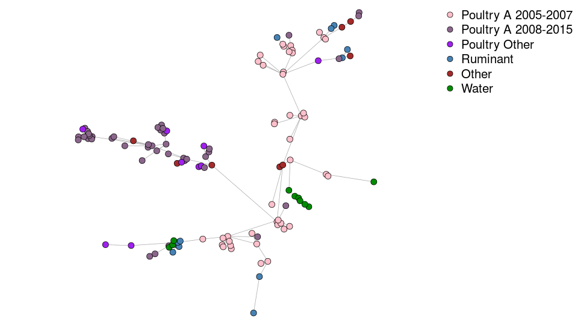
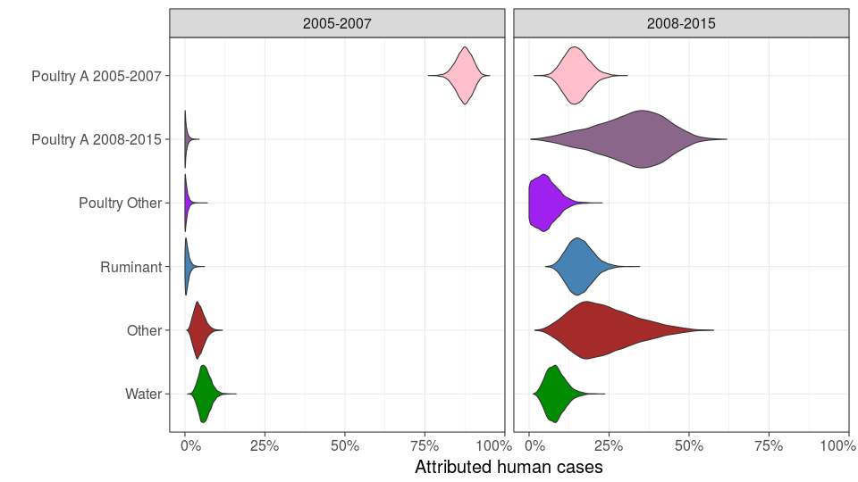

## Campylobacteriosis cases: which source?

  
  
  

  

##

  

## Genomic distribution on humans

  

## Genomic distribution on sources

  

## Source attribution

- Have genomic information from 'case' isolates

    - human cases of campylobacteriosis.
    
    - bacteria isolates from contaminated product.

- Use genetic distribution of isolates found on 'sources'

    - food, water, environment for *Campylobacter*.
    
    - sources that may have contaminated product.

- Combine to determine the likelihood that each 'source' gave
rise to each 'case'.

## Contribution of sources to cases

  

## Can also incorporate covariates on the cases

- For campylobacteriosis, exposures will differ between rural and urban people.

- Would expect people in very rural locations to have much stronger exposure to
environmental contamination by ruminants?

- For contamination of product, there might be a batch effect, or an effect of
time since equipment was sterilised?

## Genomic distribution by rurality

  

## Attribution by rurality

  

## ST-474 using whole genome sequencing

  

## ST-474 using whole genome sequencing

  

## ST-474 using whole genome sequencing

  

## ST-474 using whole genome sequencing

  

## ST-474 attribution

  

## Attribution for outbreaks

- Can do the same thing when your cases consist of just a subset, such as an outbreak
or contamination event.

- Outbreak associated with Pahiatua water supply in 2008.

- Outbreak associated with a raw milk supplier in 2011.

## Pahiatua water supply, raw milk outbreaks

  

## Requirements

- Good sampling of potential sources.

- Genomic information at appropriate resolution to allow differences between sources to be seen.
