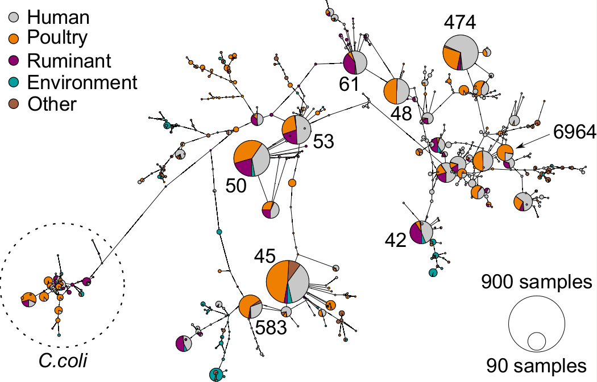

```{r setup, echo=FALSE, warning=FALSE, message=FALSE}
library(dplyr)
library(knitr)
library(mgcv)
library(maptools)
library(rgdal)
opts_chunk$set(echo=FALSE, fig.height = 5, fig.align='center', bg='transparent', dev.args=list(bg='transparent'))
sts = read.csv("data/st_counts.csv")
ur = read.csv("data/ur_counts.csv")
humans = read.csv("data/human_by_month.csv")
nz = read.csv("data/nz_cases.csv", stringsAsFactors=FALSE)
attribution = read.csv("data/attribution.csv")
humans$Date = as.Date(humans$Date)
humans$Month = as.factor(humans$Month)
nz$Date = as.Date(nz$Date)
nz$Month = as.factor(nz$Month)
alpha = function(col, alpha) { rgb(t(col2rgb(col)/255), alpha=alpha) }
par(mar=c(3,3,2,1), mgp=c(2,.7,0), tck=-.03)
ax_col = "grey20"
fig_width = 10
```

## Modelling foodborne disease

- Determining likely source of human disease

- Spatial and temporal trends and Outbreak detection

- Risk of raw milk

# Determining likely source of human disease

## Campylobacteriosis in New Zealand

- Timeseries of NZ campy.

## Campylobacteriosis in New Zealand

- XX cases

- Most are either food or env exposure

- Long term nastiness

- Costs money

## Where are people getting it from?

TODO: Picture of person getting infected from sources/river etc

- Often little epidemiological information

- Some cases likely have a common source of infection (outbreaks)

## Use genetic information

TODO: Update so it is up to 2016...

<div align="center">
  
</div>

## Overview of genetic info

TODO: Slide on genetic information

- MLST
- WGS

## MLST dist on humans

Barplot of human ST distribution (common ones)

## MLST dist on sources

Barplots of same STs, overlaid onto human dist (frequency)

## MLST dist rurality

Barplots of urban/rural STs

## Island model

TODO: Maths of island model

## Results: Proportion cases urban/rural

Results from dynamic island model

## Results: Total cases urban/rural

Results from dynamic island model

## Limitations

- ST level may be too coarse? Many types shared.
   - ST-474 tree + attribution

- Urban/rural division not fine enough.
   - Picture from Jing

# Outbreak detection

## Time series Manawatu

TODO: Time series manawatu + smoothed line

## Spatial trend Manawatu before 2008

TODO: Spatial trend of manawatu before 2008

## Spatial trend Manawatu post 2008

TODO Spatial trend of manawatu after 2008

## Model

TODO:

- Maths

- Idea

## Temporal trend

TODO: Temporal video

## Spatial trend broad

TODO: Spatial video1

## Spatial trend Palmy

TODO: Spatial video2

## Outbreaks

TODO: Outbreak plot, highlighting the two events

## Outbreak: Pahiatua water supply

TODO: Attr Pahiatua

## Outbreak: Palmerston North raw milk

TODO: Attribution of Palmerston North raw milk

## Outbreaks: Havelock North

TODO: HBDHB outbreak time series, highlighted HN outbreaks
