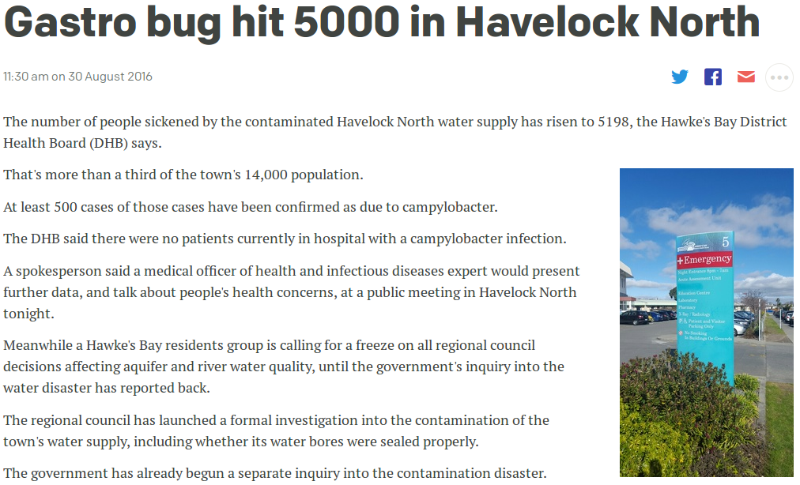
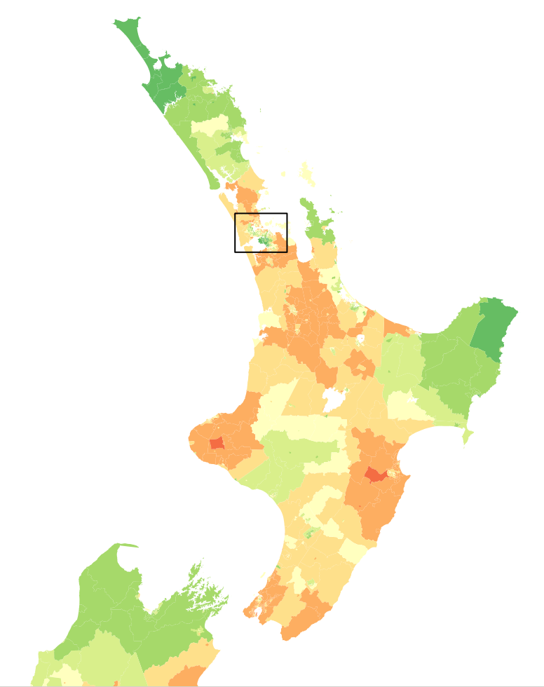
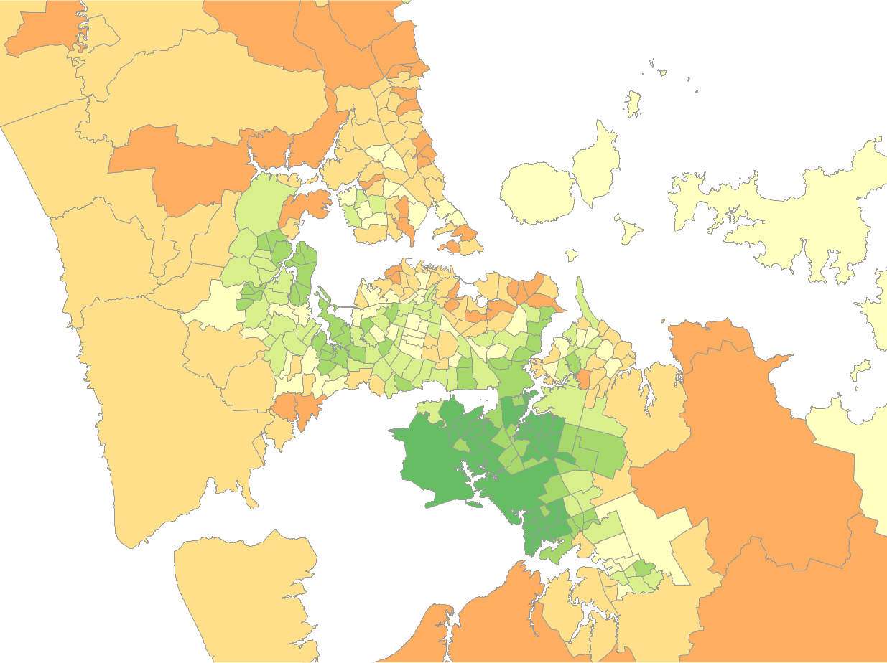
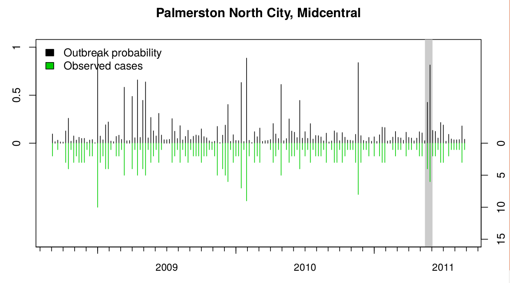
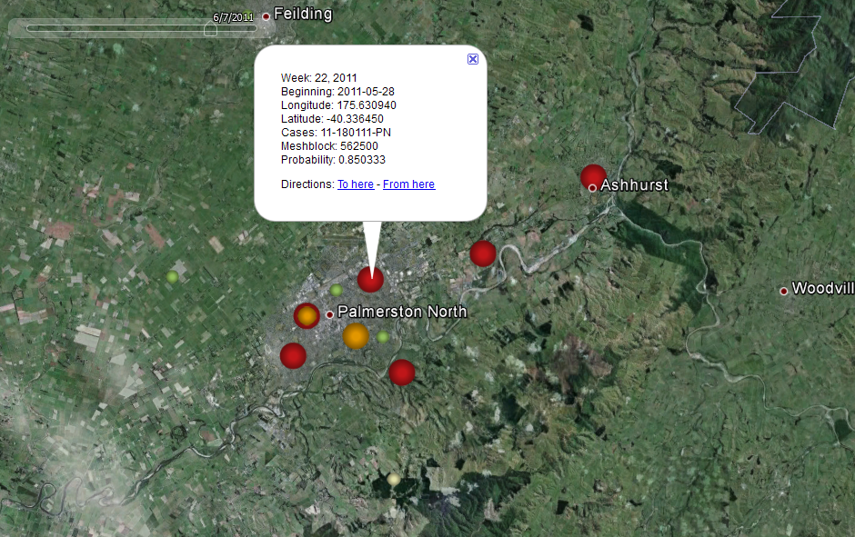
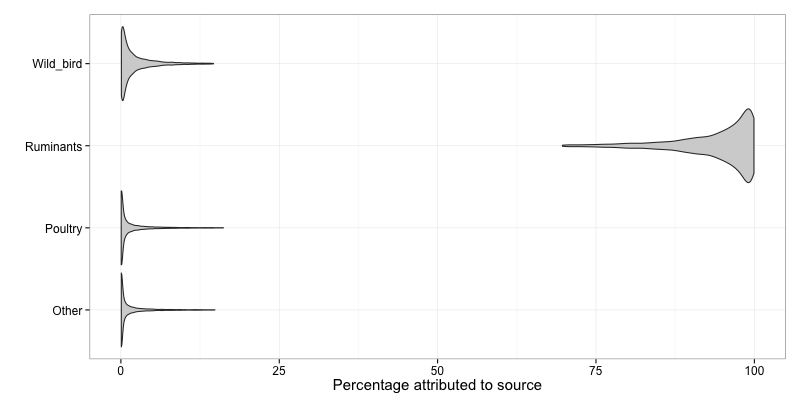

```{r setup, echo=FALSE, warning=FALSE, message=FALSE}
library(dplyr)
library(knitr)
library(mgcv)
library(maptools)
library(rgdal)
opts_chunk$set(echo=FALSE, fig.height = 5, fig.align='center', bg='transparent', dev.args=list(bg='transparent'))
sts = read.csv("data/st_counts.csv")
ur = read.csv("data/ur_counts.csv")
humans = read.csv("data/human_by_month.csv")
nz = read.csv("data/nz_cases.csv", stringsAsFactors=FALSE)
attribution = read.csv("data/attribution.csv")
humans$Date = as.Date(humans$Date)
humans$Month = as.factor(humans$Month)
nz$Date = as.Date(nz$Date)
nz$Month = as.factor(nz$Month)
alpha = function(col, alpha) { rgb(t(col2rgb(col)/255), alpha=alpha) }
par(mar=c(3,3,2,1), mgp=c(2,.7,0), tck=-.03)
ax_col = "grey20"
fig_width = 10
```

## Modelling foodborne disease

- Determining likely source of human disease

- Spatial and temporal trends and Outbreak detection

- Risk of raw milk

# Determining likely source of human disease

## Campylobacteriosis in New Zealand

- Timeseries of NZ campy.

## Campylobacteriosis in New Zealand

- XX cases

- Most are either food or env exposure

- Long term nastiness

- Costs money

## Where are people getting it from?

TODO: Picture of person getting infected from sources/river etc

- Often little epidemiological information

- Some cases likely have a common source of infection (outbreaks)

## Use genetic information

TODO: Update so it is up to 2016...

<div align="center">
  
</div>

## Overview of genetic info

- MLST
- WGS

## MLST dist on humans

TODO: Barplot of human ST distribution (common ones)

## MLST dist on sources

TODO: Barplots of same STs, overlaid onto human dist (frequency)

## MLST dist rurality

TODO: Barplots of urban/rural STs

## Island model

TODO: Maths of island model

## Results: Proportion cases urban/rural

TODO: Results from dynamic island model

## Results: Total cases urban/rural

TODO: Results from dynamic island model

## Limitations

- ST level may be too coarse? Many types shared.
   - ST-474 tree + attribution

- Urban/rural division not fine enough.
   - TODO: Picture from Jing

# Outbreak detection

## Time series Manawatu

TODO: Time series manawatu + smoothed line

## Spatial trend Manawatu before 2008

TODO: Spatial trend of manawatu before 2008

## Spatial trend Manawatu post 2008

TODO Spatial trend of manawatu after 2008

## Model

- Maths

- Idea

## Temporal trend

## Spatial trend broad

## Spatial trend Palmy

## Outbreaks

## Outbreak: Pahiatua water supply

## Outbreak: Palmerston North raw milk

# Rawmilk

## Rawmilk

What is the prevalence of

 - *E. coli* O157
 - *Campylobacter jejuni
 - Listeria monocytogenes
 - Salmonella

TODO: Add paper link here

## Idea

Prevalence and shedding of different pathogens by dairy cows (amount of pathogen in faeces)

PLUS

TBCs as proxy for faecal contamination in RM (amount of faeces in RM)

EQUALS

Amount of pathogen in RM

## Study

- 80 farms
- TBC measured
- SCC measured (no corr with TBC)
- TBC likely good proxy of faecal contamination

## TBC model

- Data

## TBC model

- Fits over data

## Pathogen model

- Prevalence, shedding

## Results

- Amount in raw milk


##

<div align="center">
  
</div>

##

## Attribution of Manawatu cases

```{r dynamic_poultry_ruminants, fig.width=9, fig.height=5}
attr_dyn = read.csv("data/attribution_dynamic.csv", stringsAsFactors = FALSE)
source_map4 = read.csv("data/4_source.csv", stringsAsFactors = FALSE) %>% filter(Label != "Human") %>%
  dplyr::select(Number, Label) %>% unique %>% arrange(Number)

times = 1:max(attr_dyn$Month)
years = max(attr_dyn$Month)/12 - 1

# we split the plot into two regions
layout(matrix(c(1,2), 2, 1), heights=c(2,1))

par(mai = c(0.5, 1, 0.5, 0.5))
poultry = attr_dyn %>% filter(Source == "Poultry")
plot(NULL, xlim=range(times), ylim=c(0, 40), type="n", main="", xaxt="n", ylab="Cases", xlab="", xaxs="i", yaxs="i", yaxt="n")
axis(1, at=0:(years+1)*12, labels = rep("", years+2))
axis(2, at=0:4*10)
mtext(2005 + 0:years, at=0:years*12+6, line=0.3, side=1, cex = 0.8)
for (j in seq_len(nrow(source_map4))) {
  li = poultry$li * poultry$Count
  mu = poultry$mu * poultry$Count
  ui = poultry$ui * poultry$Count
  polygon(c(times, rev(times)), c(li, rev(ui)), col="grey70", border=NA)
  lines(times, mu, col="black", lwd=2)
}
legend("topright", legend="Poultry", bty="n")

par(mai = c(0.5, 1, 0, 0.5))
ruminants = attr_dyn %>% filter(Source == "Ruminants")
plot(NULL, xlim=range(times), ylim=c(0, 20), type="n", main="", xaxt="n", ylab="Cases", xlab="", xaxs="i", yaxs="i", yaxt="n")
axis(1, at=0:(years+1)*12, labels = rep("", years+2))
axis(2, at=0:4*10)
mtext(2005 + 0:years, at=0:years*12+6, line=0.3, side=1, cex = 0.8)
for (j in seq_len(nrow(source_map4))) {
  li = ruminants$li * ruminants$Count
  mu = ruminants$mu * ruminants$Count
  ui = ruminants$ui * ruminants$Count
  polygon(c(times, rev(times)), c(li, rev(ui)), col="grey70", border=NA)
  lines(times, mu, col="black", lwd=2)
}
legend("topright", legend="Ruminants", bty="n")
```

## New Zealand campylobacteriosis cases

```{r, nz cases, fig.width=fig_width}
mod.gam = gam(Cases ~ s(as.numeric(Date)) + Month, data=nz)
co = coef(mod.gam)
avg_month = mean(co[grepl("Month",names(co))])

par(mar=c(3,3.5,0.5,1), mgp=c(2,.7,0), tck=-.015)
plot(Cases ~ Date, data=nz, type="l", col=ax_col, axes=FALSE, xaxs="i", yaxs="i", ylim=c(0,2000), xlab="", ylab="")
y = predict(mod.gam, data.frame(Date=as.numeric(nz$Date), Month="Apr"), se.fit=TRUE)
axis(2, col=ax_col, col.axis=ax_col, las=1, cex.axis=0.8)
axis(1, col=ax_col, col.axis=ax_col, at=as.Date(paste0(2005:2015,"-01-01")), labels=rep("",11))
mtext(2005:2014, side=1, col=ax_col, at=as.Date(paste0(2005:2014,"-07-01")), line=0.5)
y_fit = y$fit + avg_month
polygon(c(nz$Date, rev(nz$Date)), c(y_fit+y$se.fit, rev(y_fit - y$se.fit)), col=alpha("steelblue", 0.3), border=NA)
lines(nz$Date, y_fit, col="steelblue", lwd=2)
title(ylab="Cases", col.lab=ax_col, line=2.5)
```

## New Zealand campylobacteriosis cases

- 
<table class='container'>
 <tr>
  <td style='vertical-align:bottom'>
    
  </td>
  <td style='width:700px, vertical-align:bottom'>
    
  </td>
</tr></table>

## Potential outbreaks

<div align='center'>
  
</div>

## Potential outbreaks

<div align='center'>
  
</div>

## Pahiatua waterborne outbreak 2008

<div align='center'>
  
</div>

## Various other projects

- Modelling pathogen counts in raw milk

- Assessing genetic diversity of E.coli presence of read errors

- Risk of disease emergence vs biodiversity for fragmented habitats

- Modelling bat survival in presence of disease

- Estimating effect of immunisation on measles transmission in New Zealand

- Are outbreaks of Ebola linked to bat birth pulses?
