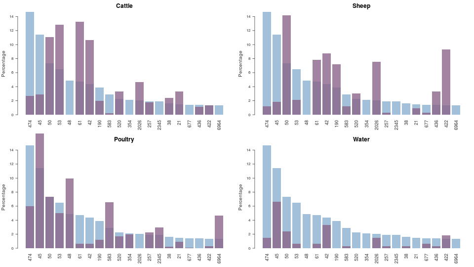
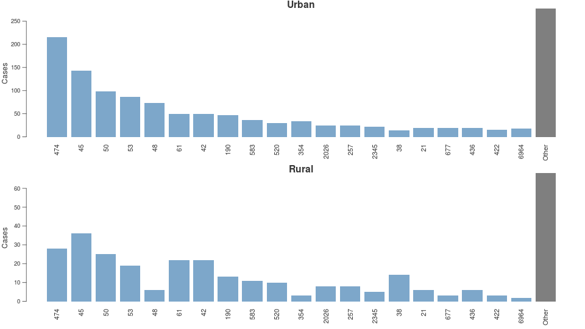
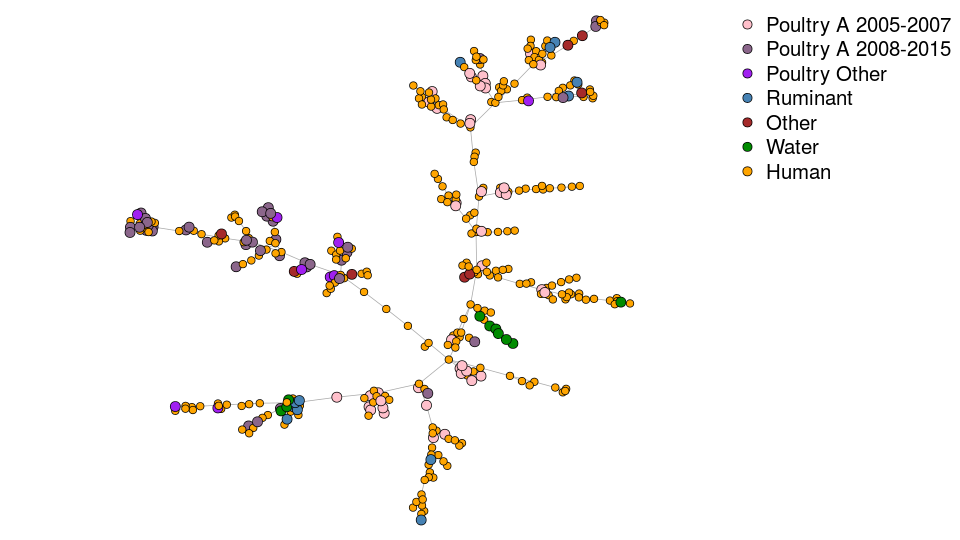
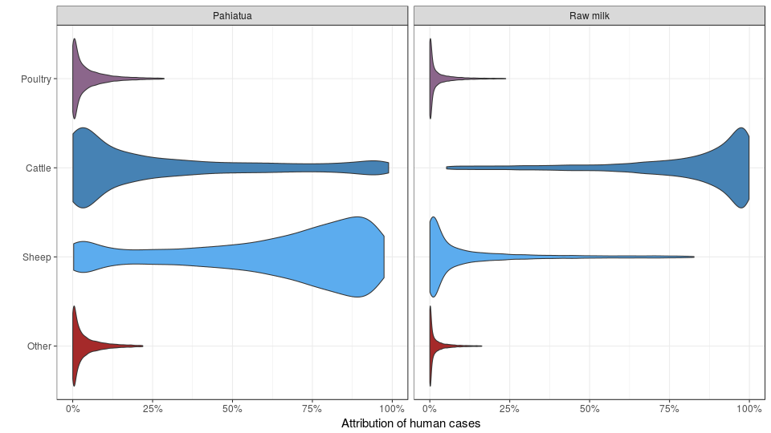

## Modelling foodborne disease

- Determining likely source of human disease

- Spatial and temporal trends and Outbreak detection

- Risk of raw milk

## Campylobacteriosis in New Zealand

  

## Campylobacteriosis in New Zealand

- XX cases

- Most are either food or env exposure

- Long term nastiness

- Costs money

# Determining likely source of human disease

## Where are people getting it from?

TODO: Picture of person getting infected from sources/river etc

- Often little epidemiological information

- Some cases likely have a common source of infection (outbreaks)

## Use genetic information

  

## Overview of genetic info

TODO: Slide on genetic information

- MLST
- WGS

## MLST dist on humans

  

## MLST dist on sources

  

## MLST dist rurality

  

## Island model

TODO: Maths of island model

## Results: Proportion cases urban/rural

  

## Results: Total cases urban/rural

  

## Limitations

- ST level may be too coarse as many types are shared across sources.

- Urban/rural division may not be fine enough?

## Attribution by rurality

  

## ST-474 using whole genome sequencing

  

## ST-474 using whole genome sequencing

  

## ST-474 attribution

  

# Outbreak detection

## Time series Manawatu

  

## Spatial trend Manawatu before 2008

  

## Spatial trend Manawatu post 2008

  

## Model

TODO:

- Maths / Idea

## Temporal trend

   <video src='figures/temporal_fit.mp4' width='960px' loop='true' autoplay='true'/>

## Spatial trend broad

   <video src='figures/spatial_fit.mp4' width='960px' loop='true' autoplay='true'/>

## Spatial trend Palmy

   <video src='figures/spatial_fit_palmy.mp4' width='960px' loop='true' autoplay='true'/>

## Outbreaks

  

## Outbreaks

  

## Outbreaks: Pahiatua water supply, Palmerston North raw milk

  

## Outbreaks: Havelock North

TODO: HBDHB outbreak time series, highlighted HN outbreaks
