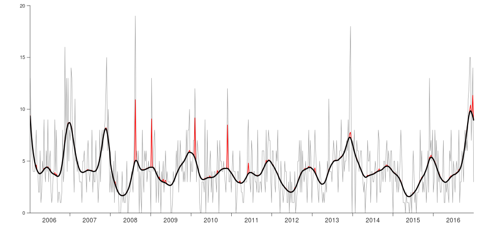

## Who am I?

  
  
  

## Campylobacteriosis in New Zealand

  

## Two questions

Are there cases with common exposures (outbreaks?)

  
  

Where are people getting it from?

  
  
  

## Smooth temporal trend

   <video src='figures/temporal_fit.mp4' width='960px' loop='true' autoplay='true'/>

## Smooth spatial trend

   <video src='figures/spatial_fit.mp4' width='960px' loop='true' autoplay='true'/>

## Smooth spatial trend: Palmerston North

   <video src='figures/spatial_fit_palmy.mp4' width='960px' loop='true' autoplay='true'/>

## Outbreaks?

  

## *Campylobacter* you get depends where you live

  

