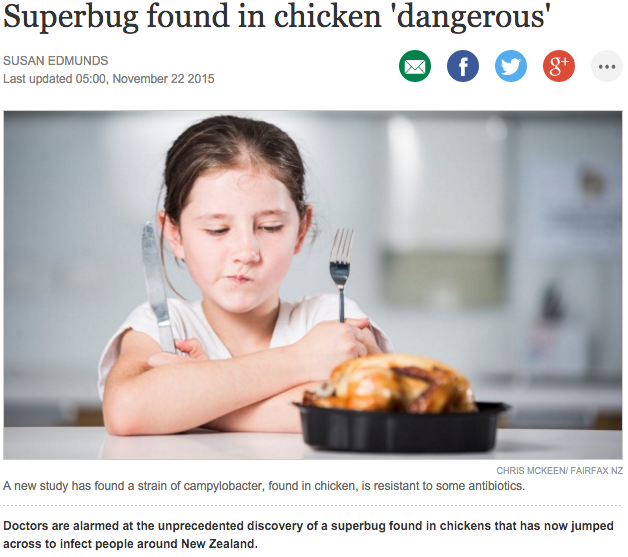
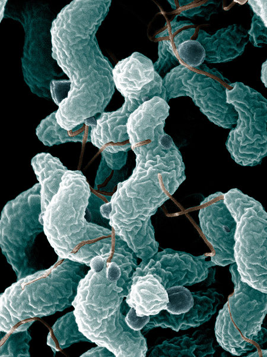
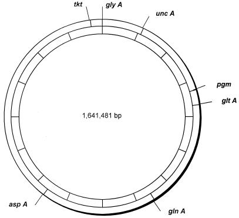

```{r setup, echo=FALSE, warning=FALSE, message=FALSE}
library(dplyr)
library(knitr)
library(mgcv)
library(maptools)
library(rgdal)
opts_chunk$set(echo=FALSE, fig.height = 5, fig.align='center', bg='transparent', dev.args=list(bg='transparent'))
sts = read.csv("data/st_counts.csv")
ur = read.csv("data/ur_counts.csv")
humans = read.csv("data/human_by_month.csv")
nz = read.csv("data/nz_cases.csv", stringsAsFactors=FALSE)
attribution = read.csv("data/attribution.csv")
humans$Date = as.Date(humans$Date)
humans$Month = as.factor(humans$Month)
nz$Date = as.Date(nz$Date)
nz$Month = as.factor(nz$Month)
alpha = function(col, alpha) { rgb(t(col2rgb(col)/255), alpha=alpha) }
par(mar=c(3,3,2,1), mgp=c(2,.7,0), tck=-.03)
ax_col = "grey20"
fig_width = 10
```

##

<div align="center">
  
</div>

## Campylobacteriosis

<table class='container'>
 <tr>
  <td style='vertical-align:top'>
- *Campylobacter* 'twisted bacteria'

- Predominantly food-borne.

- NZ's most notified disease.

- 6770 cases in 2014.

- For every case notified, there are an estimated 7.6 community cases. (Wheeler et. al. 1999)

- Each case is estimated to cost around $600. (Lake et. al. 2009)

</td>
  <td style='width:420px, vertical-align:top'>
   
  </td>
</tr></table>

## Manawatu sentinel surveillance site

```{r, manawatu map, fig.width=8.5, fig.height=6}
manawatu = readShapeSpatial("maps/midcentral.shp")

nzmg.proj = '+proj=nzmg +lat_0=-41.0 +lon_0=173.0 +x_0=2510000.0 +y_0=6023150.0 +ellps=intl +units=m +towgs84=59.47,-5.04,187.44,0.47,-0.1,1.024,-4.5993 '

nz.map = readOGR("maps/NZ_region-NZTM2000.shp", layer="NZ_region-NZTM2000", verbose=FALSE)
nz2.map = spTransform(nz.map, nzmg.proj)
par(mar=c(0,0,0,0))
plot(nz2.map, col="grey80", border=NA, xlim=c(2300000,3000000), ylim=c(5900000, 6760000))
plot(manawatu, col="steelblue", border=NA, add=TRUE)
```

## Manawatu campylobacteriosis cases

```{r, human cases, fig.width=fig_width}
mod.gam = gam(Count ~ s(as.numeric(Date)) + Month, data=humans)
co = coef(mod.gam)
avg_month = mean(co[grepl("Month",names(co))])

par(mar=c(3,3,0.5,1), mgp=c(2,.7,0), tck=-.015)
plot(Count ~ Date, data=humans, type="l", col=ax_col, axes=FALSE, xaxs="i", yaxs="i", ylim=c(0,40), xlab="", ylab="Cases", col.lab=ax_col)
y = predict(mod.gam, data.frame(Date=as.numeric(humans$Date), Month="1"), se.fit=TRUE)
axis(2, col=ax_col, col.axis=ax_col, las=1, cex.axis=0.8)
axis(1, col=ax_col, col.axis=ax_col, at=as.Date(paste0(2005:2015,"-01-01")), labels=rep("",11))
mtext(2005:2014, side=1, col=ax_col, at=as.Date(paste0(2005:2014,"-07-01")), line=0.5)
y_fit = y$fit + avg_month
polygon(c(humans$Date, rev(humans$Date)), c(y_fit+y$se.fit, rev(y_fit - y$se.fit)), col=alpha("steelblue", 0.3), border=NA)
lines(humans$Date, y_fit, col="steelblue", lwd=2)
```

## New Zealand campylobacteriosis cases

```{r, nz cases, fig.width=fig_width}
mod.gam = gam(Cases ~ s(as.numeric(Date)) + Month, data=nz)
co = coef(mod.gam)
avg_month = mean(co[grepl("Month",names(co))])

par(mar=c(3,3.5,0.5,1), mgp=c(2,.7,0), tck=-.015)
plot(Cases ~ Date, data=nz, type="l", col=ax_col, axes=FALSE, xaxs="i", yaxs="i", ylim=c(0,2000), xlab="", ylab="")
y = predict(mod.gam, data.frame(Date=as.numeric(nz$Date), Month="Apr"), se.fit=TRUE)
axis(2, col=ax_col, col.axis=ax_col, las=1, cex.axis=0.8)
axis(1, col=ax_col, col.axis=ax_col, at=as.Date(paste0(2005:2015,"-01-01")), labels=rep("",11))
mtext(2005:2014, side=1, col=ax_col, at=as.Date(paste0(2005:2014,"-07-01")), line=0.5)
y_fit = y$fit + avg_month
polygon(c(nz$Date, rev(nz$Date)), c(y_fit+y$se.fit, rev(y_fit - y$se.fit)), col=alpha("steelblue", 0.3), border=NA)
lines(nz$Date, y_fit, col="steelblue", lwd=2)
title(ylab="Cases", col.lab=ax_col, line=2.5)
```

## MLST for *Campylobacter*

<table class='container'>
 <tr>
  <td style='vertical-align:top'>
- Seven housekeeping genes (loci).

- Unique genes are assigned different numbers (alleles).

- The combination of alleles gives the **multilocus sequence type**.

</td>
  <td style='width:400px, vertical-align:top'>
   
  </td>
</tr></table>

## MLST for *Campylobacter*

ST   aspA glnA gltA glyA pgm txt uncA
--   ---- ---- ---- ---- --- --- ----
474     2    4    1    2   2   1    5
61      1    4    2    2   6   3   17
2381  175  251  216  282 359 293  102
48      2    4    1    2   7   1    5
2370    1    4    2    2   6   5   17

## MLST distribution of human cases

```{r, mlst dist human, fig.width=10}
# find the top 14 sequence types
par(mar=c(3,3,0,1), mgp=c(2,.7,0), tck=-.015)
top20 = order(-sts$Human)[1:20]
cols = c(rep(alpha("steelblue",0.5), 20), "grey70")
barplot(c(sts$Human[top20], sum(sts$Human[-top20])), names=c(sts$ST[top20], "Other"), col=cols, border=NA, yaxt="n", cex.names = 0.9, las=2, col.axis=ax_col)
axis(2, col=ax_col, col.axis=ax_col, las=1, cex.axis=0.8)
title(ylab="Cases", col.lab=ax_col)
```

## MLSTs are source specific

```{r, source specific mlst, fig.width=8, fig.height=5.5}
ST_to_plot = c(474, 61, 50, 2381)
par(mfrow=c(2,2), mar=c(3,3,2,1), mgp=c(2,.7,0), tck=-.02)
for (st in ST_to_plot) {
  bp = sts %>% filter(ST == st) %>% select(Poultry, Ruminants, Other, Water) %>% as.matrix
  barplot(bp, col=alpha("steelblue",0.5), border=NA, yaxt="n", cex.names = 1, las=1, col.axis=ax_col, ylim=c(0,75))
#  x = unlist(par()["mfg"])[2]
  axis(2, col=ax_col, col.axis=ax_col, las=1, cex.axis=0.8)
#  text(ifelse(x == 1, 5, 0.2), 70, st, col = ax_col, cex = 2, adj=c(ifelse(x == 1, 1, 0), 0.5))
  title(paste("ST",st), col.main=ax_col, cex.main=1.3)
  title(ylab="Isolates", col.lab=ax_col)
}
```

## MLSTs differ by rurality

```{r, mlst dist rurality, fig.width=10}
# find the top 14 sequence types
par(mfrow=c(2,1), mar=c(3,3,1,1), mgp=c(2,.7,0), tck=-.03)
top20 = match(sts$ST[order(-sts$Human)[1:20]], ur$ST)
cols = c(rep(alpha("steelblue",0.5), 20), "grey70")
barplot(c(ur$Urban[top20], sum(ur$Urban[-top20])), names=c(ur$ST[top20], "Other"), col=cols, border=NA, yaxt="n", cex.names = 0.9, las=2, col.axis=ax_col)
axis(2, col=ax_col, col.axis=ax_col, las=1, cex.axis=0.8)
title("Urban", col.main=ax_col, cex.main=1.3)
title(ylab="Cases", col.lab=ax_col)
barplot(c(ur$Rural[top20], sum(ur$Rural[-top20])), names=c(ur$ST[top20], "Other"), col=cols, border=NA, yaxt="n", cex.names = 0.9, las=2, col.axis=ax_col)
axis(2, col=ax_col, col.axis=ax_col, las=1, cex.axis=0.8)
title("Rural", col.main=ax_col, cex.main=1.3)
title(ylab="Cases", col.lab=ax_col)
```

## MLSTs differ by rurality

```{r, mlst dist rurality highlight, fig.width=10}
# find the top 14 sequence types
par(mfrow=c(2,1), mar=c(3,3,1,1), mgp=c(2,.7,0), tck=-.03)
top20 = match(sts$ST[order(-sts$Human)[1:20]], ur$ST)
highlight = ur$ST[top20] %in% c(38,42,48,61,354,474)
cols = c(rep(alpha("steelblue",0.5), 20), "grey70")
cols[c(highlight,FALSE)] = "steelblue"
barplot(c(ur$Urban[top20], sum(ur$Urban[-top20])), names=c(ur$ST[top20], "Other"), col=cols, border=NA, yaxt="n", cex.names = 0.9, las=2, col.axis=ax_col)
axis(2, col=ax_col, col.axis=ax_col, las=1, cex.axis=0.8)
title("Urban", col.main=ax_col, cex.main=1.3)
title(ylab="Cases", col.lab=ax_col)
barplot(c(ur$Rural[top20], sum(ur$Rural[-top20])), names=c(ur$ST[top20], "Other"), col=cols, border=NA, yaxt="n", cex.names = 0.9, las=2, col.axis=ax_col)
axis(2, col=ax_col, col.axis=ax_col, las=1, cex.axis=0.8)
title("Rural", col.main=ax_col, cex.main=1.3)
title(ylab="Cases", col.lab=ax_col)
```

## Questions

- Does the proportion of human cases attributed to each source change seasonally?

- Did the intervention in the poultry industry work?

- Is attribution related to rurality?

# Modelling | R package islandR

## islandR model{.bigequation .flexbox .vcenter}

$$
P(\mathsf{st}) = \sum_j P(\mathsf{st} \mid \mathsf{source}_j) P(\mathsf{source}_j)
$$

## islandR model{.bigequation .flexbox .vcenter}

$$
P(\mathsf{st}) = \sum_j \underbrace{P(\mathsf{st} \mid \mathsf{source}_j)}_\text{genomic model} P(\mathsf{source}_j)
$$

## islandR model{.bigequation .flexbox .vcenter}

$$
P(\mathsf{st}) = \sum_j \underbrace{P(\mathsf{st} \mid \mathsf{source}_j)}_\text{genomic model} \underbrace{P(\mathsf{source}_j)}_\text{attribution to source}
$$

## Genomic model

Assume that *Campylobacter* genotypes arise from two or more homogeneous mixing populations
where we have

- **Mutation**, where novel alleles are produced.

- **Recombination**, where the allele at a given loci has been observed before, but
not in this allelic profile.

- **Migration** between sources, where genotypes have been observed previously.

## Mutation

ST   aspA glnA gltA glyA pgm txt uncA
--   ---- ---- ---- ---- --- --- ----
474     2    4    1    2   2   1    5
?       2    4    1    2  29   1    5

<br />

- We have a novel allele at the pgm locus.

- We assume this genotype has arisen through **mutation**.

## Recombination

ST   aspA glnA gltA glyA pgm txt uncA
--   ---- ---- ---- ---- --- --- ----
474     2    4    1    2   2   1    5
?       2    4    1    2   1   1    5
45     4    7    10    4   1   7    1
3718   2    4     1    4   1   1    5

<br />

- We have seen this pgm allele before, but haven't seen this genotype.

- We assume it arose through **recombination**.

## Migration

ST   aspA glnA gltA glyA pgm txt uncA
--   ---- ---- ---- ---- --- --- ----
474     2    4    1    2   2   1    5
?       2    4    1    2   2   1    5

<br />

- This is just 474. We've seen it before, but possibly not on this source.

- We assume it arose through **migration**.

## Genomic model{.smaller}

$$
\phi(y \mid k,X) = \sum_{c\in X} \frac{M_{S_ck}}{N_{S_c}} \prod_{l=1}^7 \left\{\begin{array}{ll}
\mu_k & \text{if $y^{l}$ is novel,}\\
(1-\mu_k)R_k\sum_{j=1}^K M_{jk}f^l_{y^lj} & \text{if $y^{l}\neq c^l$}\\
(1-\mu_k)\left[1 - R_k(1 - \sum_{j=1}^K M_{jk}f^l_{y^lj})\right] & \text{if $y^{l}=c^l$}
\end{array} \right.
$$

- $X$ are the previously observed sequences.
- $c$ comes from source $S_c$.
- $\mu_k$ be the probability of a novel mutant allele from source $k$.
- $R_k$ be the probability that a type has undergone recombination in souce $k$.
- $M_{jk}$ be the probability of an allele migrating from source $j$ to $k$.
- $f^l_{aj}$ be the frequency with which allele $a$ has been observed at locus $l$ in those genotypes sampled from source $j$.

## islandR model{.bigequation .flexbox .vcenter}

$$
P(\mathsf{st}) = \sum_j \underbrace{P(\mathsf{st} \mid \mathsf{source}_j)}_\text{genomic model} \underbrace{P(\mathsf{source}_j)}_\text{attribution to source}
$$

## islandR model{.bigequation .flexbox .vcenter}

$$
P(\mathsf{st} \mid \underbrace{t, \mathbf{x}}_\text{covariates}) =
 \sum_j \underbrace{P(\mathsf{st} \mid \mathsf{source}_j)}_\text{genomic model} \underbrace{P(\mathsf{source}_j \mid t, \mathbf{x})}_\text{attribution with covariates}
$$

## islandR attribution

Nested within each source $j$ we have
$$
\begin{aligned}
\mathsf{logit}\left(P(\mathsf{source}_j \mid t, \mathbf{x})\right) &= \mathsf{Location}_\mathbf{x} \cdot \mathbf{1}\left[t \geq 2008\right] \cdot \mathsf{Month}_t + \epsilon_{\mathbf{x}t}\\
\epsilon_{\mathbf{x}t} &\sim \mathsf{Normal}(\rho \epsilon_{\mathbf{x}(t-1)}, \sigma^2)
\end{aligned}
$$

- Covariates are estimated as a Gibbs step conditional on correlation $\rho$, variance $\sigma^2$ and $P(\mathsf{source}_j \mid t, \mathbf{x})$.

- $\phi$ and $\sigma^2$ are then updated using Gibbs conditional on the covariates and $P(\mathsf{source}_j \mid t, \mathbf{x})$.

- $P(\mathsf{source}_j \mid t, \mathbf{x})$ are block updated from the full conditional, interleaved with Metropolis Hastings steps.

# Results

## Urban attribution

```{r, fig.width=fig_width}
urban = attribution[attribution$Location == 0,]
par(mfrow=c(2,1), mar=c(3,3,2,1), mgp=c(2,.7,0), tck=-.03)
cols = c("plum4", "steelblue")
sources = c("Poultry", "Ruminants")
for (src in seq_along(sources)) {
  d = urban[urban$Source == sources[src],]
  n_times = max(d$Time)
  times = 1:n_times
  plot(NULL, xlim=range(times), ylim=c(0,1), type="n", main=d$Source[1], axes=FALSE, col.main=ax_col, ylab="", xlab="", xaxs="i", yaxs="i")
  polygon(c(times, rev(times)), c(d$ui[times], rev(d$li[times])), col=alpha(cols[src], 0.25), border=NA)
  polygon(c(times, rev(times)), c(d$yi[times], rev(d$xi[times])), col=alpha(cols[src], 0.35), border=NA)
  lines(times, d$mu[times], lwd=2, col=cols[src])
  axis(1, at=seq(0,120,by=12), labels=rep("", 11), col=ax_col, col.axis=ax_col, cex.axis=0.8)
  axis(2, at=seq(0,1,by=0.2), labels=paste0(seq(0,100,by=20),'%'), col=ax_col, col.axis=ax_col, cex.axis=0.8, las=1)
  mtext(2005:2014, side=1, col=ax_col, at=seq(0,108,by=12)+6, line=0.5)
}
```

## Rural attribution

```{r, fig.width=fig_width}
rural = attribution[attribution$Location == 1,]
par(mfrow=c(2,1), mar=c(3,3,2,1), mgp=c(2,.7,0), tck=-.03)
cols = c("plum4", "steelblue")
sources = c("Poultry", "Ruminants")
for (src in seq_along(sources)) {
  d = rural[rural$Source == sources[src],]
  n_times = max(d$Time)
  times = 1:n_times
  plot(NULL, xlim=range(times), ylim=c(0,1), type="n", main=d$Source[1], axes=FALSE, col.main=ax_col, ylab="", xlab="", xaxs="i", yaxs="i")
  polygon(c(times, rev(times)), c(d$ui[times], rev(d$li[times])), col=alpha(cols[src], 0.25), border=NA)
  polygon(c(times, rev(times)), c(d$yi[times], rev(d$xi[times])), col=alpha(cols[src], 0.35), border=NA)
  lines(times, d$mu[times], lwd=2, col=cols[src])
  axis(1, at=seq(0,120,by=12), labels=rep("", 11), col=ax_col, col.axis=ax_col, cex.axis=0.8)
  axis(2, at=seq(0,1,by=0.2), labels=paste0(seq(0,100,by=20),'%'), col=ax_col, col.axis=ax_col, cex.axis=0.8, las=1)
  mtext(2005:2014, side=1, col=ax_col, at=seq(0,108,by=12)+6, line=0.5)
}
```

## Urban attribution

```{r, fig.width=fig_width}
urban = attribution[attribution$Location == 0,]
par(mfrow=c(2,1), mar=c(3,3,2,1), mgp=c(2,.7,0), tck=-.03)
cols = c("plum4", "steelblue")
sources = c("Poultry", "Ruminants")
for (src in seq_along(sources)) {
  d = urban[urban$Source == sources[src],]
  mu = d$mu * d$Count
  li = d$li * d$Count
  ui = d$ui * d$Count
  xi = d$xi * d$Count
  yi = d$yi * d$Count

  n_times = max(d$Time)
  times = 1:n_times
  plot(NULL, xlim=range(times), ylim=c(0,40), type="n", main=d$Source[1], axes=FALSE, col.main=ax_col, ylab="", xlab="", xaxs="i", yaxs="i")
  polygon(c(times, rev(times)), c(ui[times], rev(li[times])), col=alpha(cols[src], 0.25), border=NA)
  polygon(c(times, rev(times)), c(yi[times], rev(xi[times])), col=alpha(cols[src], 0.35), border=NA)
  lines(times, mu[times], lwd=2, col=cols[src])
  axis(1, at=seq(0,120,by=12), labels=rep("", 11), col=ax_col, col.axis=ax_col, cex.axis=0.8)
  axis(2, at=seq(0,40,by=10), col=ax_col, col.axis=ax_col, cex.axis=0.8, las=1)
  title(ylab="Cases", col.lab=ax_col)
  mtext(2005:2014, side=1, col=ax_col, at=seq(0,108,by=12)+6, line=0.5)
}
```

## Rural attribution

```{r, fig.width=fig_width}
rural = attribution[attribution$Location == 1,]
par(mfrow=c(2,1), mar=c(3,3,2,1), mgp=c(2,.7,0), tck=-.03)
cols = c("plum4", "steelblue")
sources = c("Poultry", "Ruminants")
for (src in seq_along(sources)) {
  d = rural[rural$Source == sources[src],]
  mu = d$mu * d$Count
  li = d$li * d$Count
  ui = d$ui * d$Count
  xi = d$xi * d$Count
  yi = d$yi * d$Count
  n_times = max(d$Time)
  times = 1:n_times
  plot(NULL, xlim=range(times), ylim=c(0,40), type="n", main=d$Source[1], axes=FALSE, col.main=ax_col, ylab="", xlab="", xaxs="i", yaxs="i")
  polygon(c(times, rev(times)), c(ui[times], rev(li[times])), col=alpha(cols[src], 0.25), border=NA)
  polygon(c(times, rev(times)), c(yi[times], rev(xi[times])), col=alpha(cols[src], 0.35), border=NA)
  lines(times, mu[times], lwd=2, col=cols[src])
  axis(1, at=seq(0,120,by=12), labels=rep("", 11), col=ax_col, col.axis=ax_col, cex.axis=0.8)
  axis(2, at=seq(0,40,by=10), col=ax_col, col.axis=ax_col, cex.axis=0.8, las=1)
  title(ylab="Cases", col.lab=ax_col)
  mtext(2005:2014, side=1, col=ax_col, at=seq(0,108,by=12)+6, line=0.5)
}
```

## Summary

- Urban cases tend to be more associated with poultry, and rural cases with ruminants.

- There does seem to be some evidence for seasonality in attribution.

- The poultry intervention in 2007 resulted in a marked reduction in poultry related cases in urban areas, less strong in rural areas.

- Very few cases associated with water or other sources.

- **Limitation**: Genomic model assumed constant through time.

## Acknowledgements

- **MidCentral Public Health Services**: Tui Shadbolt, <br>
Adie Transom
- **Medlab Central**: Lynn Rogers
- **ESR**: Phil Carter
- **mEpiLab**: Rukhshana Akhter, Julie Collins-Emerson,<br>
Ahmed Fayaz, Anne Midwinter, Sarah Moore, Antoine Nohra, Angie Reynolds
- **Ministry for Primary Industries**: Donald Campbell,<br>
Peter van der Logt
- Petra Müllner
- Nigel French

##{.banner}

Slides:  http://bit.ly/1M5PP4O

Twitter: [&#64;jmarshallnz](https://twitter.com/jmarshallnz)

Github:  [jmarshallnz](https://github.com/jmarshallnz)

<div class="hugetext">**Thanks for listening!**</div>


## Urban water/other attribution

```{r, fig.width=fig_width}
urban = attribution[attribution$Location == 0,]
par(mfrow=c(2,1), mar=c(3,3,2,1), mgp=c(2,.7,0), tck=-.03)
cols = c("plum4", "steelblue")
sources = c("Other", "Water")
for (src in seq_along(sources)) {
  d = urban[urban$Source == sources[src],]
  n_times = max(d$Time)
  times = 1:n_times
  plot(NULL, xlim=range(times), ylim=c(0,1), type="n", main=d$Source[1], axes=FALSE, col.main=ax_col, ylab="", xlab="", xaxs="i", yaxs="i")
  polygon(c(times, rev(times)), c(d$ui[times], rev(d$li[times])), col=alpha(cols[src], 0.25), border=NA)
  polygon(c(times, rev(times)), c(d$yi[times], rev(d$xi[times])), col=alpha(cols[src], 0.35), border=NA)
  lines(times, d$mu[times], lwd=2, col=cols[src])
  axis(1, at=seq(0,120,by=12), labels=rep("", 11), col=ax_col, col.axis=ax_col, cex.axis=0.8)
  axis(2, at=seq(0,1,by=0.2), labels=paste0(seq(0,100,by=20),'%'), col=ax_col, col.axis=ax_col, cex.axis=0.8, las=1)
  mtext(2005:2014, side=1, col=ax_col, at=seq(0,108,by=12)+6, line=0.5)
}
```

## Rural water/other attribution

```{r, fig.width=fig_width}
rural = attribution[attribution$Location == 1,]
par(mfrow=c(2,1), mar=c(3,3,2,1), mgp=c(2,.7,0), tck=-.03)
cols = c("plum4", "steelblue")
sources = c("Other", "Water")
for (src in seq_along(sources)) {
  d = rural[rural$Source == sources[src],]
  n_times = max(d$Time)
  times = 1:n_times
  plot(NULL, xlim=range(times), ylim=c(0,1), type="n", main=d$Source[1], axes=FALSE, col.main=ax_col, ylab="", xlab="", xaxs="i", yaxs="i")
  polygon(c(times, rev(times)), c(d$ui[times], rev(d$li[times])), col=alpha(cols[src], 0.25), border=NA)
  polygon(c(times, rev(times)), c(d$yi[times], rev(d$xi[times])), col=alpha(cols[src], 0.35), border=NA)
  lines(times, d$mu[times], lwd=2, col=cols[src])
  axis(1, at=seq(0,120,by=12), labels=rep("", 11), col=ax_col, col.axis=ax_col, cex.axis=0.8)
  axis(2, at=seq(0,1,by=0.2), labels=paste0(seq(0,100,by=20),'%'), col=ax_col, col.axis=ax_col, cex.axis=0.8, las=1)
  mtext(2005:2014, side=1, col=ax_col, at=seq(0,108,by=12)+6, line=0.5)
}
```

## Urban water/other attribution

```{r, fig.width=fig_width}
urban = attribution[attribution$Location == 0,]
par(mfrow=c(2,1), mar=c(3,3,2,1), mgp=c(2,.7,0), tck=-.03)
cols = c("plum4", "steelblue")
sources = c("Other", "Water")
for (src in seq_along(sources)) {
  d = urban[urban$Source == sources[src],]
  mu = d$mu * d$Count
  li = d$li * d$Count
  ui = d$ui * d$Count
  xi = d$xi * d$Count
  yi = d$yi * d$Count

  n_times = max(d$Time)
  times = 1:n_times
  plot(NULL, xlim=range(times), ylim=c(0,40), type="n", main=d$Source[1], axes=FALSE, col.main=ax_col, ylab="", xlab="", xaxs="i", yaxs="i")
  polygon(c(times, rev(times)), c(ui[times], rev(li[times])), col=alpha(cols[src], 0.25), border=NA)
  polygon(c(times, rev(times)), c(yi[times], rev(xi[times])), col=alpha(cols[src], 0.35), border=NA)
  lines(times, mu[times], lwd=2, col=cols[src])
  axis(1, at=seq(0,120,by=12), labels=rep("", 11), col=ax_col, col.axis=ax_col, cex.axis=0.8)
  axis(2, at=seq(0,40,by=10), col=ax_col, col.axis=ax_col, cex.axis=0.8, las=1)
  title(ylab="Cases", col.lab=ax_col)
  mtext(2005:2014, side=1, col=ax_col, at=seq(0,108,by=12)+6, line=0.5)
}
```

## Rural water/other attribution

```{r, fig.width=fig_width}
rural = attribution[attribution$Location == 1,]
par(mfrow=c(2,1), mar=c(3,3,2,1), mgp=c(2,.7,0), tck=-.03)
cols = c("plum4", "steelblue")
sources = c("Other", "Water")
for (src in seq_along(sources)) {
  d = rural[rural$Source == sources[src],]
  mu = d$mu * d$Count
  li = d$li * d$Count
  ui = d$ui * d$Count
  xi = d$xi * d$Count
  yi = d$yi * d$Count
  n_times = max(d$Time)
  times = 1:n_times
  plot(NULL, xlim=range(times), ylim=c(0,40), type="n", main=d$Source[1], axes=FALSE, col.main=ax_col, ylab="", xlab="", xaxs="i", yaxs="i")
  polygon(c(times, rev(times)), c(ui[times], rev(li[times])), col=alpha(cols[src], 0.25), border=NA)
  polygon(c(times, rev(times)), c(yi[times], rev(xi[times])), col=alpha(cols[src], 0.35), border=NA)
  lines(times, mu[times], lwd=2, col=cols[src])
  axis(1, at=seq(0,120,by=12), labels=rep("", 11), col=ax_col, col.axis=ax_col, cex.axis=0.8)
  axis(2, at=seq(0,40,by=10), col=ax_col, col.axis=ax_col, cex.axis=0.8, las=1)
  title(ylab="Cases", col.lab=ax_col)
  mtext(2005:2014, side=1, col=ax_col, at=seq(0,108,by=12)+6, line=0.5)
}
```
