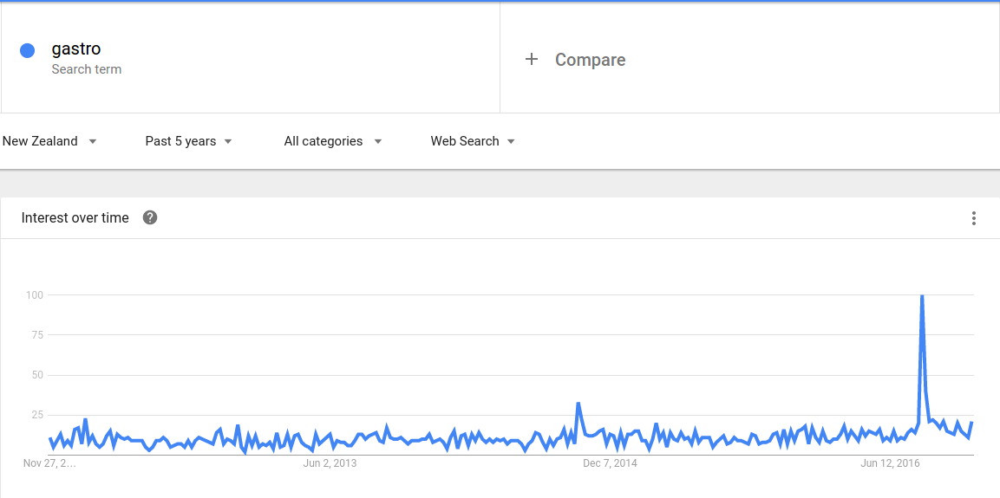
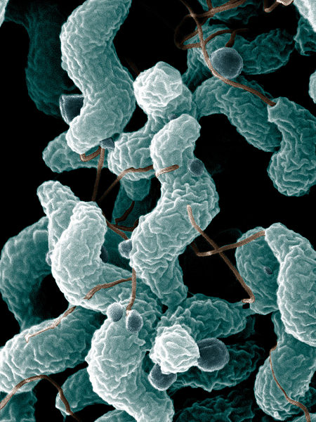

```{r setup, echo=FALSE, warning=FALSE, message=FALSE}
library(dplyr)
library(knitr)
library(mgcv)
library(maptools)
library(rgdal)
library(meshblocknz)
opts_chunk$set(echo=FALSE, fig.height = 5, fig.align='center', bg='transparent', dev.args=list(bg='transparent'))

dhb_cases = read.csv("data/dhb_cases.csv") %>%
  filter(!is.na(PopulationInterpolated)) %>%
  mutate(MonthNo = match(Month, month.name),
         Time = (Year - 2006)*12 + MonthNo,
         Rate = Count / PopulationInterpolated * 100000 * 12)

phu <- readShapeSpatial("maps/midcentral_phu")

spat <- read.table("data/Meshblocks.txt", header=TRUE) %>%
  left_join(mb2006, by=c("Meshblock06" = "MB2006")) %>%
  mutate(TA2006 = as.numeric(TA2006), TA2006 = ifelse(TA2006 == 43, 42, TA2006) - 38,
         AU2006 = as.numeric(as.factor(AU2006)))
spat.nb <- epiclustR::load_spatial_neighbours("data/Weights.GAL")

load("data/TA2006.Rdata"); TA <- new
alpha = function(col, alpha) { rgb(t(col2rgb(col)/255), alpha=alpha) }
par(mar=c(3,3,2,1), mgp=c(2,.7,0), tck=-.03)
ax_col = "grey20"
col    = c("steelblue", "plum4")
fig_width = 10


hook_libav <- function (x, options, format = "webm") 
{
    x = c(knitr:::sans_ext(x), knitr:::file_ext(x))
    fig.num = options$fig.num
    cat("running format sub() command...\n")
    cat("format = ", format, "\n")
    format = sub("^[.]", "", format)
    cat("done sub, format = ", format, "\n")
    fig.fname = paste0(sub(paste0(fig.num, "$"), "%d", x[1]), 
        ".", x[2])
    mov.fname = paste0(sub(paste0(fig.num, "$"), "", x[1]), ".", 
        format)
    extra = if (format == "webm") {
        paste("-b:v", knitr:::`%n%`(options$ffmpeg.bitrate, "1M"), "-crf 10")
    }
    ffmpeg.cmd = paste("avconv", "-y", "-r", 1/options$interval, 
        "-i", fig.fname, extra, mov.fname)
    message("executing: ", ffmpeg.cmd)
    system(ffmpeg.cmd, ignore.stdout = TRUE)
    opts = paste(knitr:::sc_split(options$aniopts), collapse = " ")
    opts = paste(sprintf("width=\"%s\"", options$out.width), 
        sprintf("height=\"%s\"", options$out.height), opts)
    sprintf("<video %s><source src=\"%s\" /><p>video of chunk %s</p></video>", 
        opts, paste0(opts_knit$get("base.url"), mov.fname), options$label)
}
hook_libav_html <- function(x, options) {
  hook_libav(x, options, knitr:::`%n%`(options$ffmpeg.format, "webm"))
}
opts_knit$set(animation.fun = hook_libav_html)
```

## RadioNZ headlines from 13-15 August 2016

- Person dies after gastro outbreak in Hawke's Bay
- Two in critical condition after gastric illness outbreak
- Animal faeces in water supply may be cause of gastro outbreak
- All schools in Havelock North to be closed for next two days as gastro crisis worsens
- Hastings District Council under fire for response to gastro bug
- Mounting anger among Havelock North locals
- Mayor apologises over 'horrific' gastro crisis
- Bug leaves Havelock North a 'ghost town', residents say
- Campylobacter 'same as labour', mother says
- Elderly hard hit by gastroenteritis bug

## Hawke's Bay campylobacteriosis cases

```{r, fig.width=fig_width, fig.height=5}
hb_cases <- dhb_cases %>% filter(DHB == "Hawke's Bay") %>% arrange(Time)
par(mar=c(2,6,1,1))
plot(Rate ~ Time, ylim=c(0, 5000), data=hb_cases, type='l', xaxt="n", xlab="", ylab="", yaxt="n", bty="n", lwd=2, col=col[1])
axis(1, at=seq(min(hb_cases$Time), max(hb_cases$Time), by=12), labels=FALSE, col=ax_col)
axis(2, at=0:5*1000, col=ax_col, cex.axis=0.8, las=1)
mtext(min(hb_cases$Year):max(hb_cases$Year), at=seq(min(hb_cases$Time), max(hb_cases$Time), by=12)+6, side=1, cex=0.8, col=ax_col)
mtext("Cases per 100,000 per annum", at=2500, line=4, side=2, col=ax_col)
box(col=ax_col)
```

## Google trends for New Zealand

<div align='center'>
  
</div>

## Campylobacteriosis

<table class='container'>
 <tr>
  <td style='vertical-align:top'>
- *Campylobacter* 'twisted bacteria'

- Predominantly food-borne.

- NZ's most notified disease.

- 6231 cases in 2015, mostly sporadic.

- **A proportion of cases are due to a common source of infection.**

</td>
  <td style='width:420px, vertical-align:top'>
   
  </td>
</tr></table>

## Manawatu sentinel surveillance site

```{r, manawatu map, fig.width=8.5, fig.height=6}
manawatu = readShapeSpatial("maps/midcentral.shp")

nzmg.proj = '+proj=nzmg +lat_0=-41.0 +lon_0=173.0 +x_0=2510000.0 +y_0=6023150.0 +ellps=intl +units=m +towgs84=59.47,-5.04,187.44,0.47,-0.1,1.024,-4.5993 '

nz.map = readOGR("maps/NZ_region-NZTM2000.shp", layer="NZ_region-NZTM2000", verbose=FALSE)
nz2.map = spTransform(nz.map, nzmg.proj)
par(mar=c(0,0,0,0))
plot(nz2.map, col="grey80", border=NA, xlim=c(2300000,3000000), ylim=c(5800000, 6760000))
plot(manawatu, col=col[1], border=NA, add=TRUE)
```
</div>

## Manawatu campylobacteriosis cases

```{r, human cases, fig.width=fig_width}
cases <- apply(TA$data$cases, 1, sum)
dates <- as.Date(names(cases))
mod <- loess(cases ~ as.numeric(dates), span = 1/10)
y <- predict(mod, se=TRUE)

par(mar=c(3,3,0.5,1), mgp=c(2,.7,0), tck=-.015)
plot(cases ~ dates, type="l", col="grey60", axes=FALSE, xaxs="i", yaxs="i", ylim=c(0,20), xlab="", ylab="Cases", col.lab=ax_col)
axis(2, col=ax_col, col.axis=ax_col, las=1, cex.axis=0.8)
axis(1, col=ax_col, col.axis=ax_col, at=as.Date(paste0(2006:2017,"-01-01")), labels=rep("",12))
mtext(2006:2016, side=1, col=ax_col, at=as.Date(paste0(2006:2016,"-07-01")), line=0.5)
y_fit = y$fit
polygon(c(dates, rev(dates)), c(y_fit+y$se.fit, rev(y_fit - y$se.fit)), col=alpha(col[1], 0.5), border=NA)
lines(dates, y_fit, col=col[1], lwd=2)
```

## Manawatu cases before 2008

```{r, fig.width=fig_width, fig.height=fig_width/2}
cases1 <- apply(TA$data$cases[TA$data$t2p==1,], 2, sum)/sum(TA$data$t2p==1)*52
cases2 <- apply(TA$data$cases[TA$data$t2p==2,], 2, sum)/sum(TA$data$t2p==2)*52

spat_case <- cbind(TA$data$spat_list, Case1 = cases1 / TA$data$popn, Case2 = cases2 / TA$data$popn)
map_data <- phu@data %>% dplyr::left_join(spat_case, by=c('MB06' = 'Spatial')) %>%
  mutate(Case1 = ifelse(is.na(Case1), 0, Case1), Case2 = ifelse(is.na(Case2), 0, Case2))

# do quantile stuff
brewerBrBG9 <- c("#F5F5F5","#F6E8C3","#DFC27D","#BF812D","#8C510A")
rate <- c(map_data$Case1,map_data$Case2)
cuts <- quantile(log(rate[rate > 0]), 0:5/5)
cols1 <- brewerBrBG9[cut(log(map_data$Case1), cuts)]
cols1[is.na(cols1)] <- brewerBrBG9[1]
cols2 <- brewerBrBG9[cut(log(map_data$Case2), cuts)]
cols2[is.na(cols2)] <- brewerBrBG9[1]

par(mfrow=c(1,2), mar=c(0,0,0,0))
plot(phu, col=cols1, border="grey60", lwd=0.3)
plot(phu, xlim=c(2727946, 2734889), ylim=c(6086900, 6094322), col=cols1, border="grey60", lwd=0.3)
```

## Manawatu cases after 2008

```{r, fig.width=fig_width, fig.height=fig_width/2}
par(mfrow=c(1,2), mar=c(0,0,0,0))
plot(phu, col=cols2, border="grey60", lwd=0.3)
plot(phu, xlim=c(2727946, 2734889), ylim=c(6086900, 6094322), col=cols2, border="grey60", lwd=0.3)
```

## Model

<div class='bigequation'>
$$
\begin{aligned}
Y_{it} &= \mathsf{Poisson}(n_{it}\lambda_{it})\\
\log{\lambda_{it}} &= R_t + U_{ip[t]} + W_{it}
\end{aligned}
$$
</div>

## Temporal trend

<div class='bigequation'>
$$
R_t \sim \mathsf{Normal}(2R_{t-1} + R_{t-2}, \tau_R)
$$
</div>

<div align='center'>
   
</div>

## Spatial trend

<div class='bigequation'>
$$
U_{ip} \sim \mathsf{Normal}(\frac{1}{n_i}\sum_{j\sim i} U_{ip}, n_i\tau_R)
$$
</div>

<div class='moveup' align='center'>
   
</div>

## Outbreak detection

<div class='bigequation'>
$$
\begin{aligned}
W_{it} &= \beta_{r[i]} X_{r[i]t}\\
X_{jt} & \underset{iid}\sim \mathsf{Bernoulli}(p)\\
\end{aligned}
$$
</div>

<div class='moveup'>
```{r zone_map, fig.width=fig_width, fig.height=4}
par(mfrow=c(1,2), mar=c(0,0,0,0))
map_data = phu@data %>% left_join(spat, by=c('MB06' = 'Meshblock06'))
pal <- RColorBrewer::brewer.pal(5, "Set2")
cols_water = epiclustR::five_colour_map(map_data$TA2006, spat.nb)
plot(phu, col=pal[cols_water], border=NA)
cols_cau = epiclustR::five_colour_map(map_data$AU2006, spat.nb)
plot(phu, col=pal[cols_cau], border=NA)
```
</div>

## Priors

<div class='bigequation'>
$$
\begin{aligned}
\tau_R &\sim \mathsf{Gamma}(5,0.01) & p &\sim \mathsf{Beta}(1,51)\\
\tau_U &\sim \mathsf{Gamma}(1,0.5) & \beta_{j} &\underset{iid}\sim \mathsf{Gamma}(1, 1)\\
\end{aligned}
$$
</div>
```{r prior_plot, fig.width=fig_width, fig.height=fig_width/4}
par(mfrow=c(1,4), mar=c(2,1,0,1))
x = seq(0, 1000, by=10)
plot_dist <- function(fun, x0, x1, label, ...) {
  x = seq(x0, x1, length.out=100)
  y = fun(x, ...)
  plot(NULL, xlim=range(x), ylim=range(y), bty="n", type="n", ylab="", yaxt="n", xlab=label)
  polygon(c(x0, x, x1), c(0, y, 0), col="grey70", border=NA)
  text(mean(range(x)), mean(range(y)), label, cex=2)
}

plot_dist(dgamma, x0=0, x1=2000, label=expression(italic("\u03C4"[R])), shape=5, rate=0.01)
plot_dist(dgamma, x0=0, x1=10, label=expression(italic("\u03C4"[U])), shape=1, rate=0.5)
plot_dist(dbeta, x0=0, x1=0.1, label=expression(italic(p)), shape1=1, shape2=51)
plot_dist(dgamma, x0=0, x1=5, label=expression(italic("\u03B2"[j])), shape=1, rate=1)
```

## Block updating MCMC scheme

<div class='bigequation'>
$$
R \sim \mathsf{Normal}(0, K^{-1})
$$
</div>

```{r, fig.width=4, fig.height=4}
# draw a band-diagonal matrix
par(mar=c(0,0,0,0))
plot(NULL, xlim=c(0,1.01), ylim=c(0,1.01), axes=FALSE, xlab="", ylab="")
polygon(c(0,0.2,1,1,0.8,0), c(1,1,0.2,0,0,0.8), col="grey70", border=NA)
lines(c(0.01,0,0,0.01)-0.01, c(-0.01,-0.01,1.01,1.01))
lines(1.01 - c(0.01,0,0,0.01), c(-0.01,-0.01,1.01,1.01))
```

## Block updating MCMC scheme

<div class='bigequation'>
$$
R_{[~~~\style{color:#4682b4}{\blacksquare}~~~]} \mid R_{[\style{color:#a3c1da}{\blacksquare}~~~\style{color:#a3c1da}{\blacksquare}]} \sim \mathsf{Normal}(-\style{color:#4682b4}{\blacksquare}^{-1}[\style{color:#a3c1da}{\blacksquare}~0~ \style{color:#a3c1da}{\blacksquare}] R, \style{color:#4682b4}{\blacksquare}^{-1})
$$
</div>
```{r, fig.width=4, fig.height=4}
# draw a band-diagonal matrix
par(mar=c(0,0,0,0))
plot(NULL, xlim=c(0,1.01), ylim=c(0,1.01), axes=FALSE, xlab="", ylab="")
polygon(c(0,0.2,1,1,0.8,0), c(1,1,0.2,0,0,0.8), col="grey70", border=NA)
rect(0.31,0.3,0.69,0.7, col=alpha(col[1], 0.7), border=NA)
rect(0,0.3,0.3,0.7, col=alpha(col[1], 0.3), border=NA)
rect(0.7,0.3,1,0.7, col=alpha(col[1], 0.3), border=NA)
lines(c(0.01,0,0,0.01)-0.01, c(-0.01,-0.01,1.01,1.01))
lines(1.01 - c(0.01,0,0,0.01), c(-0.01,-0.01,1.01,1.01))
```

## Results: Trend through time

<div align='center'>
   
</div>

## Results: Trend through space

<center>
   <video src='spatial_fit.mp4' width='960px' loop='true' autoplay='true'/>
</center>

## Results: Trend through space

<center>
   <video src='spatial_palmy_fit.mp4' width='960px' loop='true' autoplay='true'/>
</center>

## Results: Outbreaks

<center>
   <video src='outbreak_map.mp4' width='960px' loop='true' autoplay='true' controls='true'/>
</center>

## Summary

- Seems to be a reduction in urban cases pre/post 2008.

- Outbreak detection dependent on how localised cases are and whether outbreak regions match.

- It helps if outbreak regions align with epidemiology.

## Acknowledgements

- **MidCentral Public Health Services**: Tui Shadbolt, <br>
Adie Transom
- **mEpiLab**: Rukhshana Akhter, Julie Collins-Emerson,<br>
Ahmed Fayaz, Anne Midwinter, Antoine Nohra, Lynn Rogers
- **Ministry for Primary Industries**: Peter van der Logt
- Simon Spencer
- Nigel French

##{.banner}

Slides:  http://bit.ly/1M5PP4O

Twitter: [&#64;jmarshallnz](https://twitter.com/jmarshallnz)

Github:  [jmarshallnz](https://github.com/jmarshallnz)

<div class="hugetext">**Thanks for listening!**</div>


