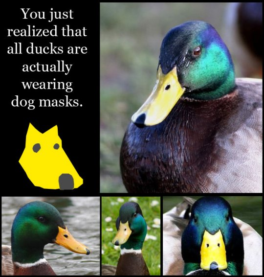

```{r,echo=FALSE}
rinline <- function(code){
  sprintf("`r %s`", code)
}
```

## A traditional statistical analysis

> - Perform the analysis.
    - Fit and assess models
    - Produce plots and tables
> - Write up a document or presentation.
    - Document methods, data
    - Add plots and tables
> - Share only the second document with others.

## The tools we use

> - Code + Narrative = Report
> - Computing language (R) and authoring language (??).
> - The authoring language could be:
>     - MS Word, OpenOffice
>     - HTML
>     - LaTeX
> - If we change the code, we may need to also change the narrative.
> - Two (or more) files to maintain.

## Existing solutions

> - R + Sweave + LaTeX can combine computing and authoring.

> - R + knitr + LaTeX is a little nicer.

> - But learning R is a pretty big step already for students.

> - They'd also need to know the incantations for doing the building.

> - Should we get them to learn LaTeX as well?

## A LaTeX example

```
\section{Methods}

Some \emph{important} introductory comments about the methods.

\subsection{The first method}

A numbered list describing the method.
\begin{enumerate}
\item{The first item}
\item{The second item}
\item{The third item}
\end{enumerate}
```
> - The content is obscured by the markup

## Ducks or dogs?

<div class="centered">

</div>

## A Markdown example

```
Methods
=======

Some *important* introductory comments about the methods.

The first method
----------------

A numbered list describing the method.
1. The first item
2. The second item
3. The third item
```

> - The content is the markup

## Formatting in R Markdown

> - Headings, sub-headings, sub-sub-headings etc.
> - Emphasis, italic, bold, strike-through
> - Ordered and unordered lists, sublists
> - Images, URL links.
> - Code blocks.
> - In-line or display math LaTeX equations.
> - Tables, links, footnotes, citations.
> - Inline R calculation, output, figures via `knitr`

## knitr: Executing R code in markdown

The code block

    `r ''````{r }
    mean(cars$speed)
    ```

produces

```{r}
    mean(cars$speed)
```

## knitr: Executing R code in markdown

The code block

    `r ''````{r}
    plot(cars)
    ```

produces...

## knitr: Executing R code in markdown

```{r}
    plot(cars)
```

## R code in-line

We can also do R computations inline, e.g.

```
The average speed is `r rinline("mean(cars$speed)")`
```

produces

```
The average speed is `r mean(cars$speed)`
```

## A single document to rule them all

> - Place analysis in R codeblocks.
> - Need only one document for both narrative and code.
> - Can share that (and data) for reproducible research.
> - Easy to alter should analysis change - it's a single file.
> - Output to
    - HTML
    - PDF (via LaTeX)
    - MS Word

## To markdown or LaTeX (or Word, or...)

> - LaTeX (or Word, or...) have a lot of control.
    - Also makes them complex.
> - Markdown is designed to be simple.
    - Means it's less flexible.
> - Markdown stays out of the way
    - You can place HTML or LaTeX code directly in the markdown file.

## Uses for R Markdown at Massey

> - Undergraduate students
    - Assignments

> - Research
    - Research reports
    - Vignettes
    - Papers?

> - Teaching
    - Slides
    - Lecture notes
    - Assignment sheets

## Integration with RStudio

> - Hit the Knit button to build.
> - Alter various settings from the UI.
> - There's a button for adding code chunks.
> - Named code chunks can be jumped to with a click.
> - Shortcuts to execute code in the current chunk.

## Your turn!

- Start RStudio
- File -> New -> R Markdown
- Name your presentation, and specify HTML output
- Knit the example document
- Play around:
    - Try fitting a linear model to the `cars` dataset in an R code-block.
    - Add the fitted line to the plot.
    - Add a sentence like 'For every unit increase in speed, there's a ___ unit increase in distance'.

## Your turn continued...

[Produce a report](http://www.massey.ac.nz/~jcmarsha/rstudio/report.html)

[Play with debugging](http://www.massey.ac.nz/~jcmarsha/rstudio/debugging.html)

[Have a go at shiny](http://www.massey.ac.nz/~jcmarsha/rstudio/shiny.html)

