## Overview of todays session

- What is RStudio?
- How might we use it at Massey?
- A **shiny** interlude...
- What is R Markdown?
- Your turn - let's play!

## An integrated development environment for R

- Sits on top of R
- Adds convenience
- Is more attractive than plain R
- The integrated environment gives added functionality

## An integrated development environment for R

- R Console
- Environment, workspace, variables
- Data viewer
- History
- Plots
- Package manager
- Help system
- Text editor
- Debugger

## Improved console

Tab auto-complete with drop-down lists for commands, data frame names etc.

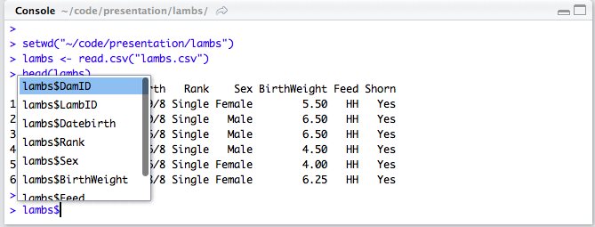

## Environment overview

Environment overview showing data frames, variables, functions. Import data-sets and clear workspace with a click.

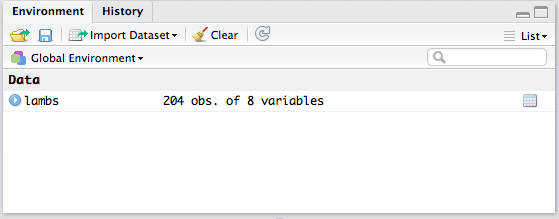

## Data viewer

Integration of `View()` function into a tab for viewing data.

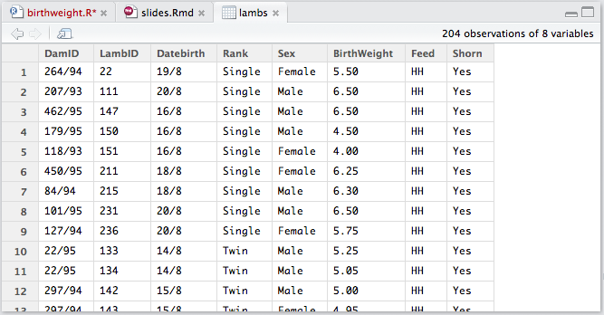

## History

History is integrated, and you can copy commands to the console or editor window with a click.

## Plots 

Can go backward and forward through plot history.

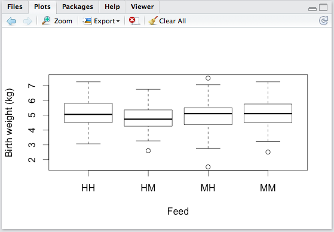

## Plots

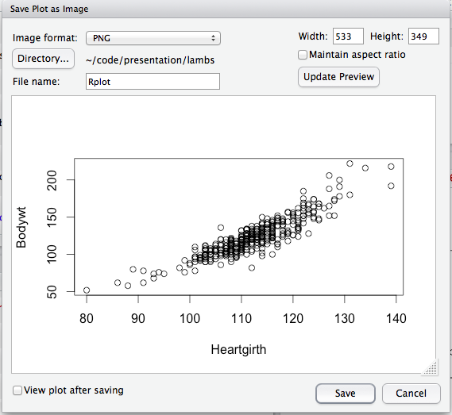

## Package manager

Can load, unload, install, remove, update packages, and get package help with a click.

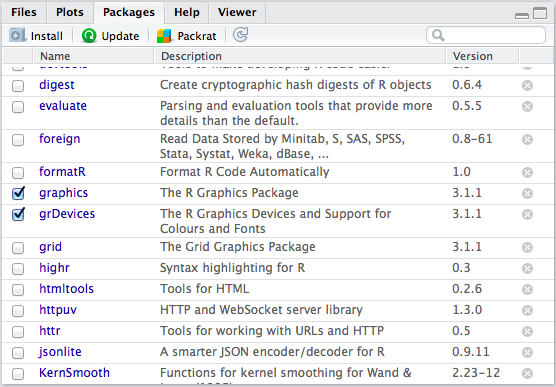

## Help system

Search and history are incorporated.

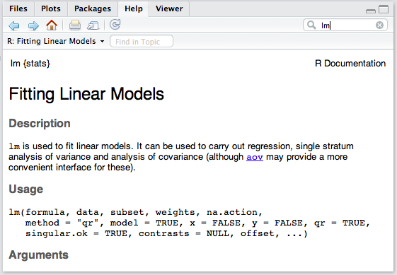

## Text editor

Syntax highlighting

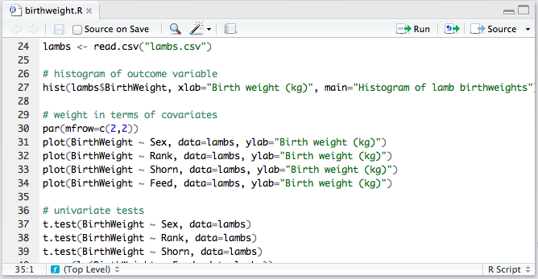

## Text editor

Tab auto-complete, auto-indentation.

## Text editor

Jump to definition/help etc.

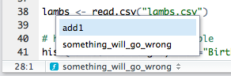

## Text editor

Function and variable extraction.

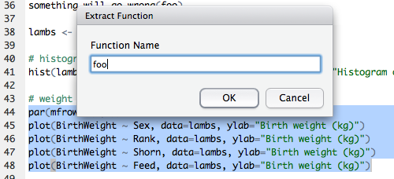

## Text editor

Function and variable extraction.

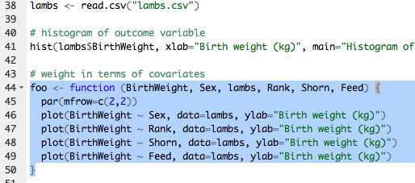

## Debugging

Add breakpoints just by clicking on the line in the editor.

On error, automatically grab traceback and re-run with debug.

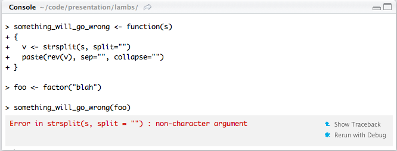

## Debugging

Step over/in, with traceback, variable state etc.

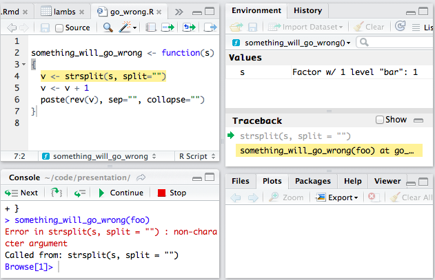

## But wait, there's more...

- Integration of source control (e.g. git)
- Integrated package development
- Package deployment (e.g. via github)
- Dynamic documents using R Markdown
- And other shiny stuff...
