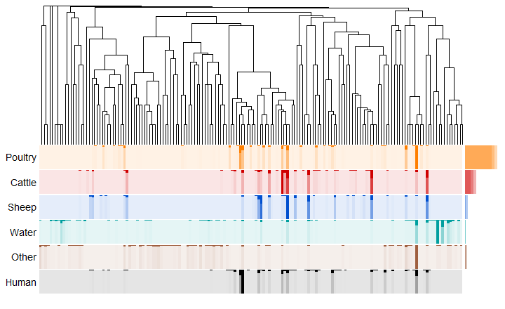
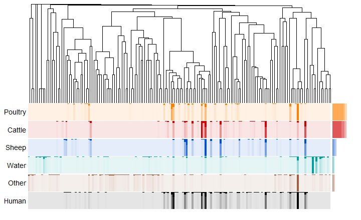
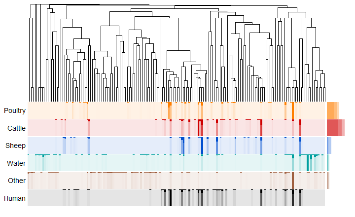
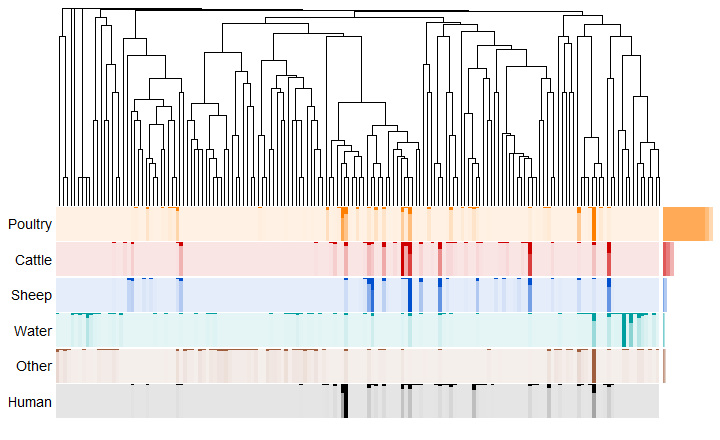
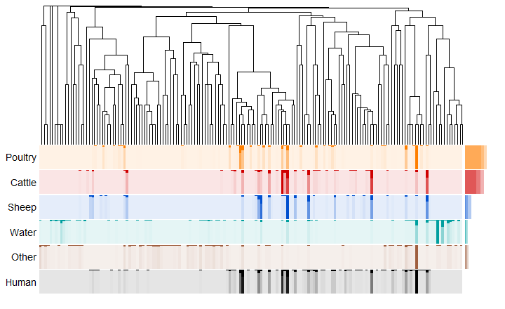
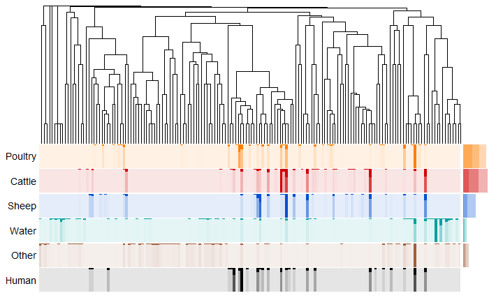
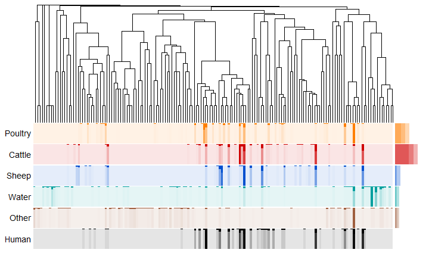
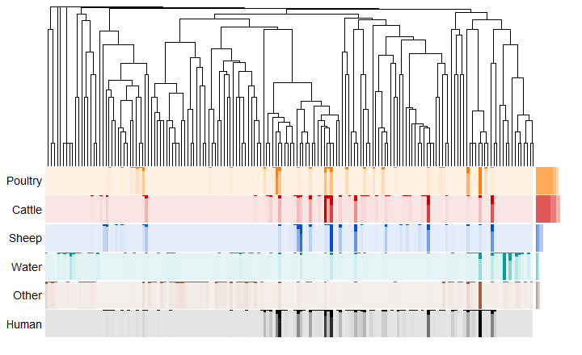

## {.flexbox .vcenter .emphasised .centered}

Given a human case, which source did it come from?

## Genetic diversity (MLST)

## Genetic diversity (2005-2007)

## Genetic diversity (2008-2014)

## Genetic diversity

## Genetic diversity (Urban)

## Genetic diversity (Rural)

## Genetic diversity

## Genetic diversity (Urban 2005-2007)

## Genetic diversity (Urban 2008-2014)

## Genetic diversity (Rural 2005-2007)

## Genetic diversity (Rural 2008-2014)

## Has poultry changed? (2005-2007)

## Has poultry changed? (2008-2014)

## {.flexbox .vcenter .centered}

https://github.com/jmarshallnz/talks